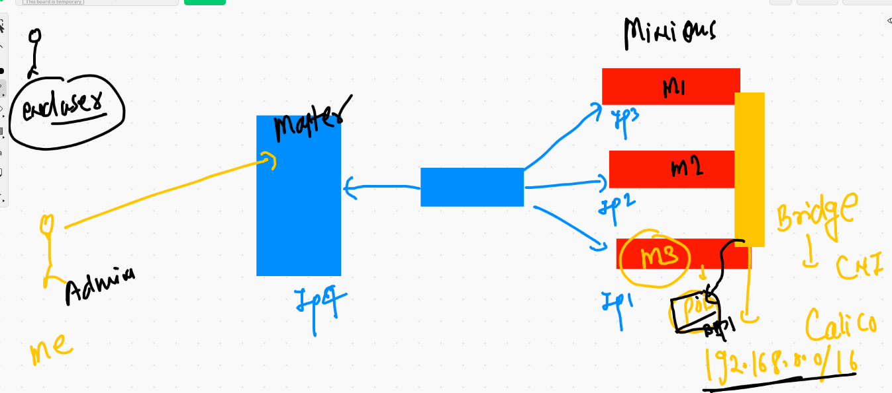
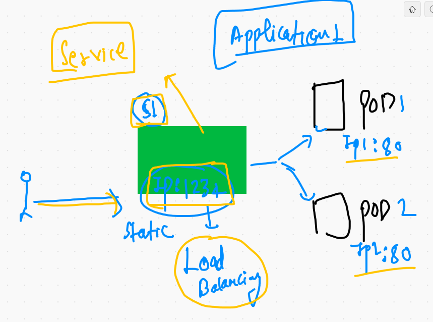
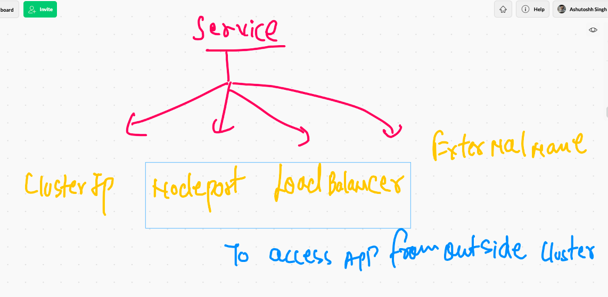
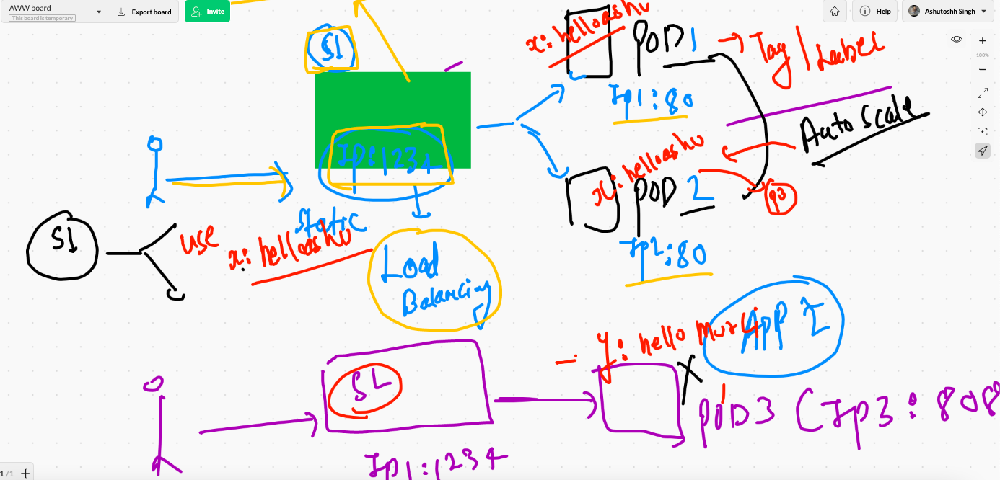
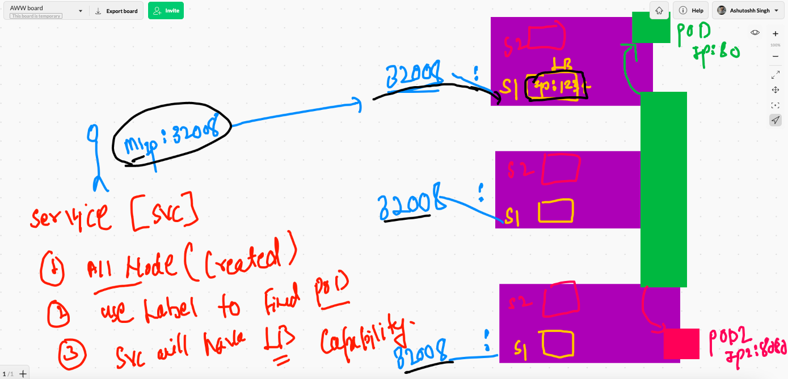

# Application deployment in k8s 

## Web application (multiweb)

### Docker based containerization 


## Passing env variable in Docker container creation time 

```
docker  run -itd --name xx1  -p 1133:80  -e x=website1  dockerashu/ciscoweb:march2021v1 

```
## Generate YAML file automatically 

### if kubectl version --client is lower than 1.18 

```
kubectl  run  ashuwebpod  --image=dockerashu/ciscoweb:march2021v1 --port=80  --restart=Never  --dry-run -o yaml
apiVersion: v1
kind: Pod
metadata:
  creationTimestamp: null
  labels:
    run: ashuwebpod
  name: ashuwebpod
spec:
  containers:
  - image: dockerashu/ciscoweb:march2021v1
    name: ashuwebpod
    ports:
    - containerPort: 80
    resources: {}
  dnsPolicy: ClusterFirst
  restartPolicy: Never
status: {}

```

### if kubectl version is 1.18 or higher 

```
❯ kubectl  run  ashuwebpod  --image=dockerashu/ciscoweb:march2021v1 --port=80    --dry-run=client -o yaml
apiVersion: v1
kind: Pod
metadata:
  creationTimestamp: null
  labels:
    run: ashuwebpod
  name: ashuwebpod
spec:
  containers:
  - image: dockerashu/ciscoweb:march2021v1
    name: ashuwebpod
    ports:
    - containerPort: 80
    resources: {}
  dnsPolicy: ClusterFirst
  restartPolicy: Always
status: {}

```

### creating yaml and storing in a file

```
kubectl  run  ashuwebpod  --image=dockerashu/ciscoweb:march2021v1 --port=80    --dry-run=client -o yaml  >webpod.yml

```

## deploy pod 

```
❯ ls
ashupod1.yaml webpod.yml
❯ kubectl  apply -f  webpod.yml
pod/ashuwebpod created
❯ kubectl  get  pods
NAME         READY   STATUS    RESTARTS   AGE
ashuwebpod   1/1     Running   0          13s
❯ kubectl  get  pods -o wide
NAME         READY   STATUS    RESTARTS   AGE   IP                NODE            NOMINATED NODE   READINESS GATES
ashuwebpod   1/1     Running   0          20s   192.168.174.201   minion-node-3   <none>           <none>


```

## Accesing application in the POd 




## Need of service  in k8s 



## service type 



## how service will find the pod 

### service will use label of POD to find 



## everything you need to remember about servie 



