# Docker pre discussions 

## application deployment problems with Bare-metal 

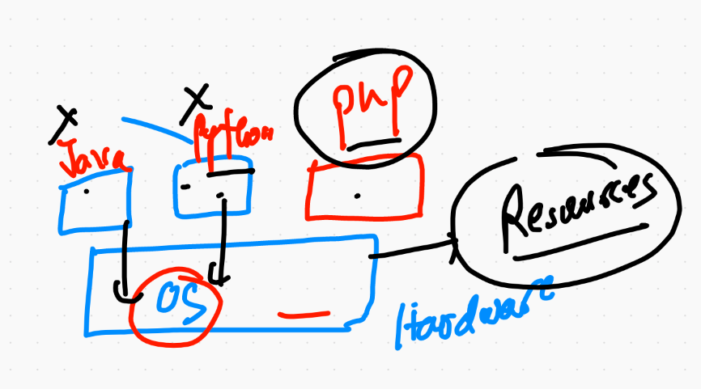


## application deployment with Virtualization technology 

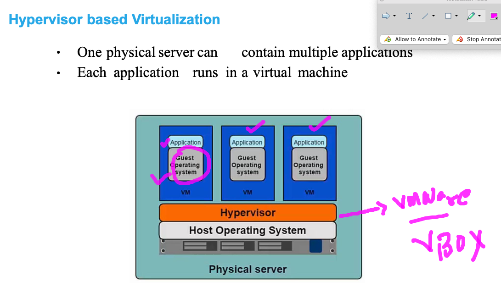

## Application doesn't require entire OS 

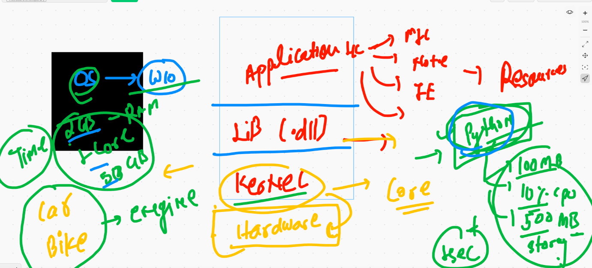

## welcome to containers 

### VM vs containers 

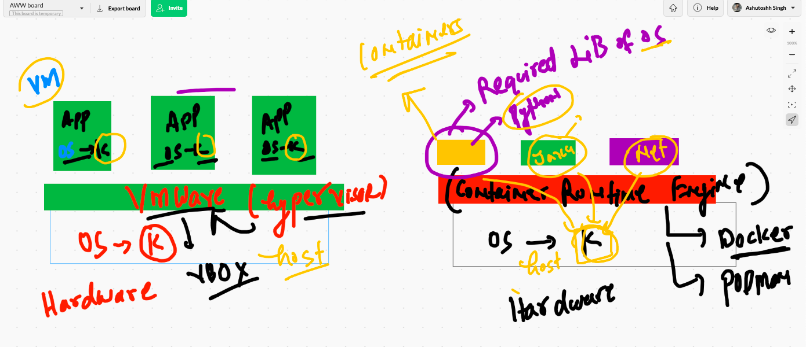

## Container support in host kernel

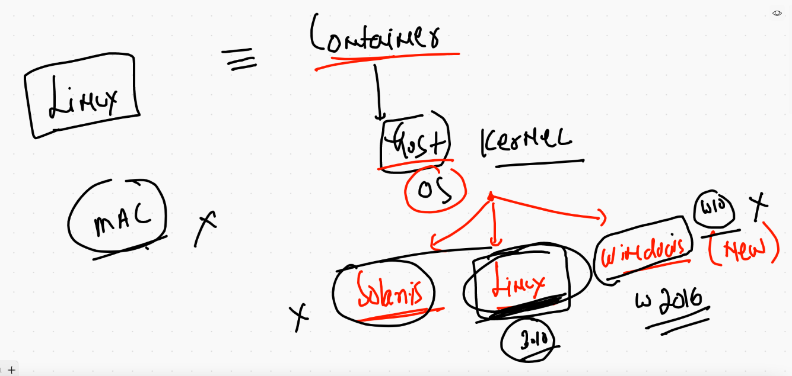

## container runtime engines  [CRE]

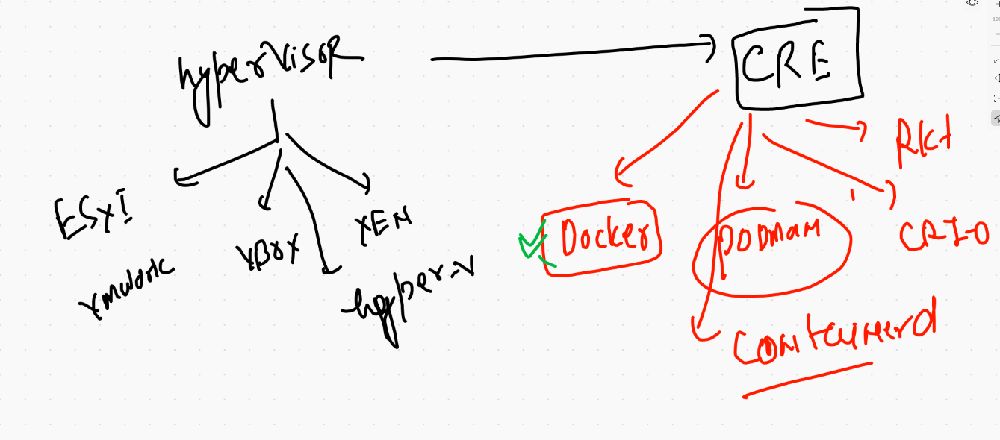

## Docker based containers 

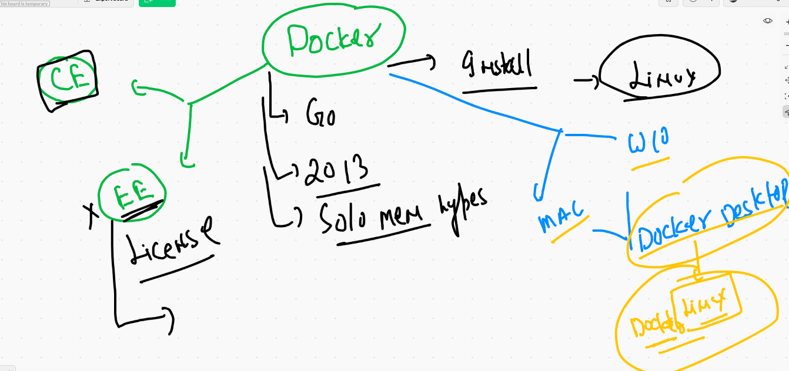

## Docker Desktop for mac 

[mac Docker Desktop](https://hub.docker.com/editions/community/docker-ce-desktop-mac)

## Docker desktop for windows 10 

[w10docker desktop](https://hub.docker.com/editions/community/docker-ce-desktop-windows/)


## Connecting docker engine from Client machine 

```
❯ docker  version
Client: Docker Engine - Community
 Cloud integration: 1.0.9
 Version:           20.10.5
 API version:       1.41
 Go version:        go1.13.15
 Git commit:        55c4c88
 Built:             Tue Mar  2 20:13:00 2021
 OS/Arch:           darwin/amd64
 Context:           default
 Experimental:      true

Server: Docker Engine - Community
 Engine:
  Version:          20.10.2
  API version:      1.41 (minimum version 1.12)
  Go version:       go1.13.15
  Git commit:       8891c58
  Built:            Mon Dec 28 16:15:28 2020
  OS/Arch:          linux/amd64
  Experimental:     false
 containerd:
  Version:          1.4.3
  GitCommit:        269548fa27e0089a8b8278fc4fc781d7f65a939b
 runc:
  Version:          1.0.0-rc92
  GitCommit:        ff819c7e9184c13b7c2607fe6c30ae19403a7aff
 docker-init:
  Version:          0.19.0
  GitCommit:        de40ad0

```

## Docker arch 

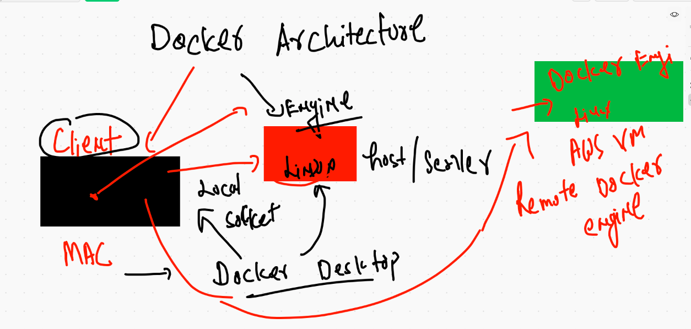

## Installing docker engine on LInux machine without docker desktop 

```
[root@ip-172-31-76-202 ~]# history 
    1  docker  version 
    2  yum  install  docker  -y
    3  history 
[root@ip-172-31-76-202 ~]# cd  /etc/sysconfig/
[root@ip-172-31-76-202 sysconfig]# ls
acpid       console         grub        man-db           nfs            rpcbind    sshd
atd         cpupower        i18n        modules          raid-check     rsyncd     sysstat
authconfig  crond           init        netconsole       rdisc          rsyslog    sysstat.ioconf
chronyd     docker          irqbalance  network          readonly-root  run-parts
clock       docker-storage  keyboard    network-scripts  rpc-rquotad    selinux
[root@ip-172-31-76-202 sysconfig]# vim  docker
[root@ip-172-31-76-202 sysconfig]# systemctl daemon-reload 
[root@ip-172-31-76-202 sysconfig]# systemctl restart docker 

```

## Docker engine install on LInux 

[centos](https://docs.docker.com/engine/install/centos/)


# Docker operations 

## From client machine only 

### search 

```
10004  docker  search mongodb 
10005  docker  search  python
10006  history
10007  docker  search  dockerashu
10008  docker  search  ashutoshh

==

❯ docker search cisco
NAME                                    DESCRIPTION                                     STARS     OFFICIAL   AUTOMATED
ciscotestautomation/pyats               Cisco pyATS, an end-to-end testing ecosystem…   17                   
ciscocloud/mesos-consul                                                                 13                   [OK]
ciscocloud/haproxy-consul                                                               9                    [OK]
ciscocloud/marathon-consul                                                              7                    [OK]
ciscocloud/nginx-consul                                                                 6                    [OK]
jeffctor/cisco-lab                      A Docker image based GNS3 lab for Cisco IOS/…   3                    [OK]
ciscocloud/nginx-mantlui                                                                3                    
ciscosso/kdk                            Kubernetes Development Kit                      3                    [OK]
ciscosso/oauth2_proxy                   https://github.com/cisco-sso/oauth2_proxy       2                    [OK]
ciscocloud/logstash                                                                     2                    [OK]
ciscocloud/mantl                        mantl.io installer                              2                    [OK]
ciscocloud/mantl-api                                                                    1                    
ciscocsirt/srimonitor                                                                   0                    
ciscosso/atlantis                   


```

### operation flow

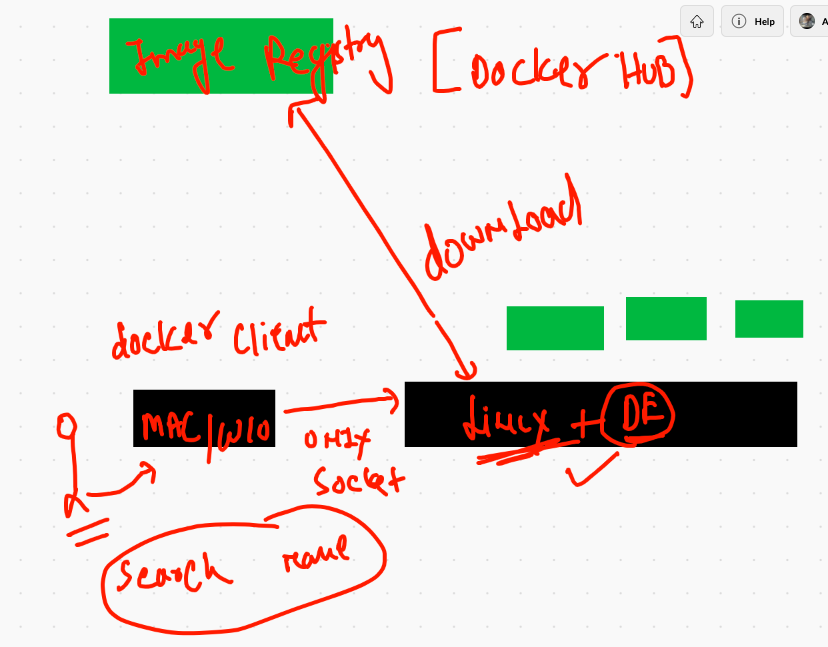


### check docker images on docker engine 

```
❯ docker images
REPOSITORY                    TAG       IMAGE ID       CREATED       SIZE
gcr.io/k8s-minikube/kicbase   v0.0.18   a776c544501a   3 weeks ago   1.08GB
❯ 

```


### download docker image from Docker hub 

```
❯ docker pull centos
Using default tag: latest
latest: Pulling from library/centos
7a0437f04f83: Pull complete 
Digest: sha256:5528e8b1b1719d34604c87e11dcd1c0a20bedf46e83b5632cdeac91b8c04efc1
Status: Downloaded newer image for centos:latest
docker.io/library/centos:latest
❯ docker images
REPOSITORY                    TAG       IMAGE ID       CREATED        SIZE
gcr.io/k8s-minikube/kicbase   v0.0.18   a776c544501a   3 weeks ago    1.08GB
centos                        latest    300e315adb2f   3 months ago   209MB

==

10017  docker pull  busybox  
10018  docker pull  alpine 
❯ docker images
REPOSITORY                    TAG       IMAGE ID       CREATED        SIZE
busybox                       latest    a9d583973f65   12 days ago    1.23MB
gcr.io/k8s-minikube/kicbase   v0.0.18   a776c544501a   3 weeks ago    1.08GB
alpine                        latest    28f6e2705743   4 weeks ago    5.61MB
centos                        latest    300e315adb2f   3 months ago   209MB


```

## on Docker engine server side image storage location 

```
[root@ip-172-31-76-202 sysconfig]# cd  /var/lib/docker/
[root@ip-172-31-76-202 docker]# ls
builder  buildkit  containers  image

```

## container need a program to run 

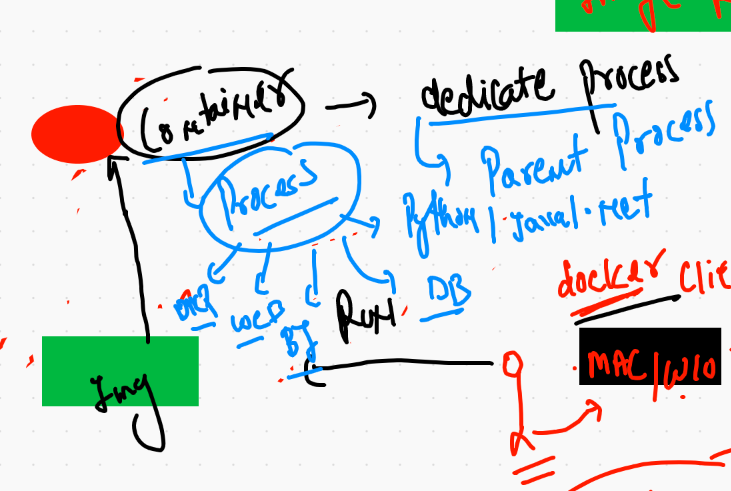

### First ever container 

```
❯ docker  run    alpine:latest  ping 127.0.0.1

PING 127.0.0.1 (127.0.0.1): 56 data bytes
64 bytes from 127.0.0.1: seq=0 ttl=64 time=0.269 ms
64 bytes from 127.0.0.1: seq=1 ttl=64 time=0.077 ms
64 bytes from 127.0.0.1: seq=2 ttl=64 time=0.150 ms
64 bytes from 127.0.0.1: seq=3 ttl=64 time=0.271 ms
64 bytes from 127.0.0.1: seq=4 ttl=64 time=0.161 ms
64 bytes from 127.0.0.1: seq=5 ttl=64 time=0.080 ms
64 bytes from 127.0.0.1: seq=6 ttl=64 time=0.178 ms
^C64 bytes from 127.0.0.1: seq=7 ttl=64 time=0.102 ms

--- 127.0.0.1 ping statistics ---
8 packets transmitted, 8 packets received, 0% packet loss
round-trip min/avg/max = 0.077/0.161/0.271 ms

```

## best practise to create contianer

```
❯ docker  run  -d  --name  ashuc1  alpine:latest  ping 127.0.0.1
3f16bc4ecfdfedb538d293cb93bfadcd3867b6e824aaa8935635f244c9e3b55d
❯ docker  ps
CONTAINER ID   IMAGE                                 COMMAND                  CREATED         STATUS         PORTS                                                                                                                                  NAMES
3f16bc4ecfdf   alpine:latest                         "ping 127.0.0.1"         5 seconds ago   Up 3 seconds                                                                                                                                          ashuc1

```


## Container createion 

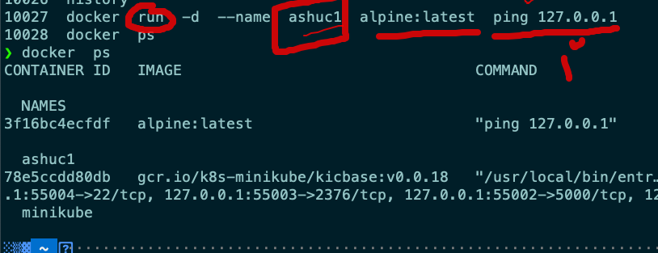

### to check only running container 

```
❯ docker  ps
CONTAINER ID   IMAGE           COMMAND            CREATED         STATUS         PORTS     NAMES
3f16bc4ecfdf   alpine:latest   "ping 127.0.0.1"   7 minutes ago   Up 7 minutes             ashuc1


```

### to check output of process running inside container 

```
❯ docker  logs   ashuc1
PING 127.0.0.1 (127.0.0.1): 56 data bytes
64 bytes from 127.0.0.1: seq=0 ttl=64 time=11.879 ms
64 bytes from 127.0.0.1: seq=1 ttl=64 time=0.090 ms
64 bytes from 127.0.0.1: seq=2 ttl=64 time=0.094 ms
64 bytes from 127.0.0.1: seq=3 ttl=64 time=0.133 ms
64 bytes from 127.0.0.1: seq=4 ttl=64 time=0.448 ms
64 bytes from 127.0.0.1: seq=5 ttl=64 time=1.845 ms
64 bytes from 127.0.0.1: seq=6 ttl=64 time=0.093 ms

```

## start a stopped container 

```
❯ docker  start  ashuc1
ashuc1
❯ docker  ps
CONTAINER ID   IMAGE           COMMAND            CREATED         STATUS         PORTS     NAMES
3f16bc4ecfdf   alpine:latest   "ping 127.0.0.1"   9 minutes ago   Up 4 seconds             ashuc1

```

### more operations on docker 

```
10023  docker  run    alpine:latest  ping 127.0.0.1 
10024  docker  ps  
10025  docker  ps  -a
10026  history
10027  docker  run  -d  --name  ashuc1  alpine:latest  ping 127.0.0.1
10028  docker  ps
10029  history
10030  docker  ps
10031* minikube stop 
10032  docker  ps
10033  docker  logs   ashuc1 
10034  history
10035  docker  ps
10036  docker  stop ashuc1
10037  docker  ps
10038  docker  ps -a
10039  docker  start  ashuc1
10040  docker  ps
10041  docker kill ashuc1
10042  docker  start  ashuc1
10043  docker  ps

```

## Docker build and container creation 

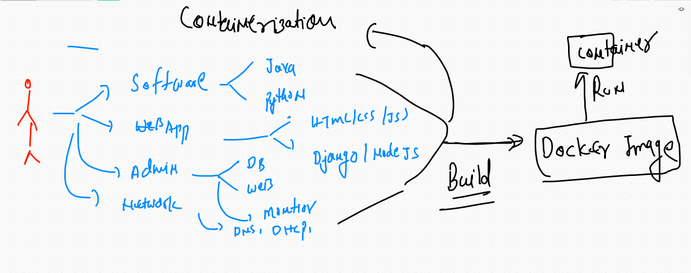

## builder tool to build custom docker images

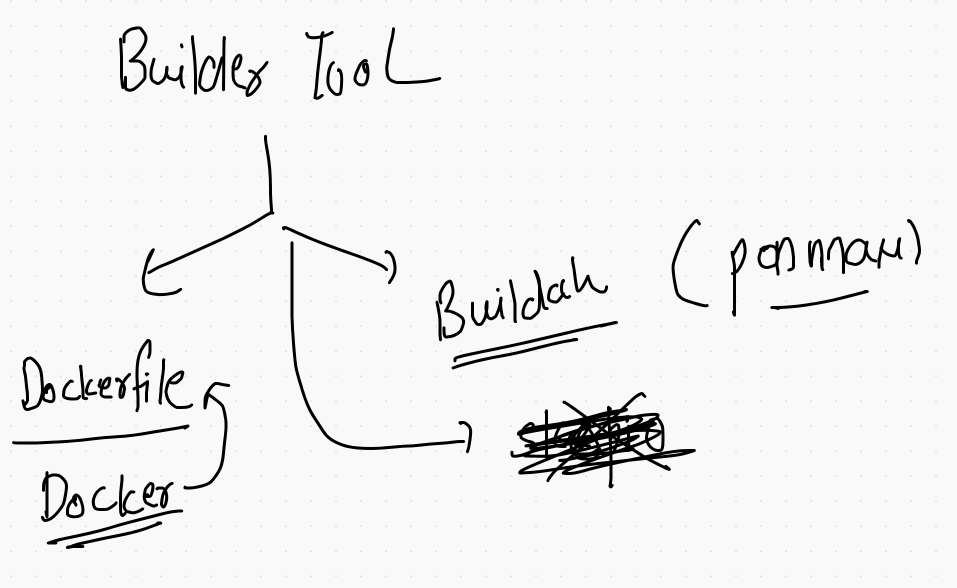

## docker build 

```
❯ docker  build  -t  ashupython:v1  Desktop/mydockerimages/pythoncode
Sending build context to Docker daemon  3.584kB
Step 1/6 : FROM centos
 ---> 300e315adb2f
Step 2/6 : MAINTAINER  ashutoshh@linux.com , 9509957594
 ---> Running in a39d76e24e4b
Removing intermediate container a39d76e24e4b
 ---> a50c4ee68b4c
Step 3/6 : RUN yum  install python3  -y
 ---> Running in 31077acc8918
CentOS Linux 8 - AppStream                      518 kB/s | 6.3 MB     00:12    
CentOS Linux 8 - BaseOS                         1.7 MB/s | 2.3 MB     00:01    
CentOS Linux 8 - Extras                          14 kB/s | 9.2 kB     00:00    
Dependencies resolved.
================================================================================
 Package             Arch   Version                             Repo       Size
================================================================================
Installing:
 python36            x86_64 3.6.8-2.module_el8.3.0+562+e162826a appstream  19 k
Installing dependencies:
 platform-python-pip noarch 9.0.3-18.el8                        baseos    1.7 M
 python3-pip         noarch 9.0.3-18.el8                        appstream  20 k
 python3-setuptools  noarch 39.2.0-6.el8                        baseos    163 k
Enabling module streams:
 python36                   3.6                                                

Transaction Summary
================================================================================
Install  4 Packages

Total download size: 1.9 M
Installed size: 7.6 M
Downloading Packages:
(1/4): python36-3.6.8-2.module_el8.3.0+562+e162  69 kB/s |  19 kB     00:00    
(2/4): python3-pip-9.0.3-18.el8.noarch.rpm       66 kB/s |  20 kB     00:00    
(3/4): platform-python-pip-9.0.3-18.el8.noarch. 3.6 MB/s | 1.7 MB     00:00    
(4/4): python3-setuptools-39.2.0-6.el8.noarch.r 811 kB/s | 163 kB     00:00    
--------------------------------------------------------------------------------
Total                                           1.2 MB/s | 1.9 MB     00:01     
warning: /var/cache/dnf/appstream-02e86d1c976ab532/packages/python3-pip-9.0.3-18.el8.noarch.rpm: Header V3 RSA/SHA256 Signature, key ID 8483c65d: NOKEY
CentOS Linux 8 - AppStream                      669 kB/s | 1.6 kB     00:00    
Importing GPG key 0x8483C65D:
 Userid     : "CentOS (CentOS Official Signing Key) <security@centos.org>"
 Fingerprint: 99DB 70FA E1D7 CE22 7FB6 4882 05B5 55B3 8483 C65D
 From       : /etc/pki/rpm-gpg/RPM-GPG-KEY-centosofficial
Key imported successfully
Running transaction check
Transaction check succeeded.
Running transaction test
Transaction test succeeded.
Running transaction
  Preparing        :                                                        1/1 
  Installing       : python3-setuptools-39.2.0-6.el8.noarch                 1/4 
  Installing       : platform-python-pip-9.0.3-18.el8.noarch                2/4 
  Installing       : python36-3.6.8-2.module_el8.3.0+562+e162826a.x86_64    3/4 
  Running scriptlet: python36-3.6.8-2.module_el8.3.0+562+e162826a.x86_64    3/4 
  Installing       : python3-pip-9.0.3-18.el8.noarch                        4/4 
  Running scriptlet: python3-pip-9.0.3-18.el8.noarch                        4/4 
  Verifying        : python3-pip-9.0.3-18.el8.noarch                        1/4 
  Verifying        : python36-3.6.8-2.module_el8.3.0+562+e162826a.x86_64    2/4 
  Verifying        : platform-python-pip-9.0.3-18.el8.noarch                3/4 
  Verifying        : python3-setuptools-39.2.0-6.el8.noarch                 4/4 

Installed:
  platform-python-pip-9.0.3-18.el8.noarch                                       
  python3-pip-9.0.3-18.el8.noarch                                               
  python3-setuptools-39.2.0-6.el8.noarch                                        
  python36-3.6.8-2.module_el8.3.0+562+e162826a.x86_64                           

Complete!
Removing intermediate container 31077acc8918
 ---> c6ae2be06bfb
Step 4/6 : RUN mkdir /mycode
 ---> Running in a08db47a782b
Removing intermediate container a08db47a782b
 ---> 967282ce99bf
Step 5/6 : COPY  cisco.py  /mycode/cisco.py
 ---> ea51904bbe94
Step 6/6 : CMD ["python3","/mycode/cisco.py"]
 ---> Running in 2c90ddb5a0b4
Removing intermediate container 2c90ddb5a0b4
 ---> 8595d186c6d0
Successfully built 8595d186c6d0
Successfully tagged ashupython:v1


```

