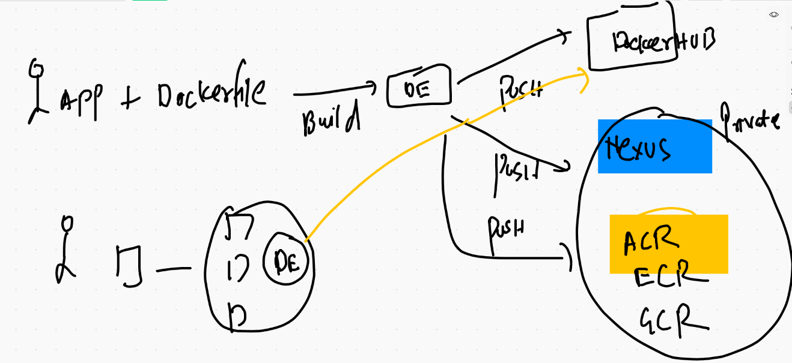
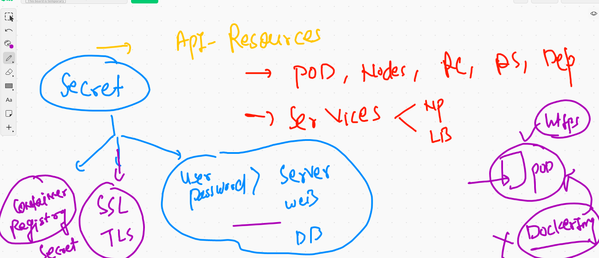
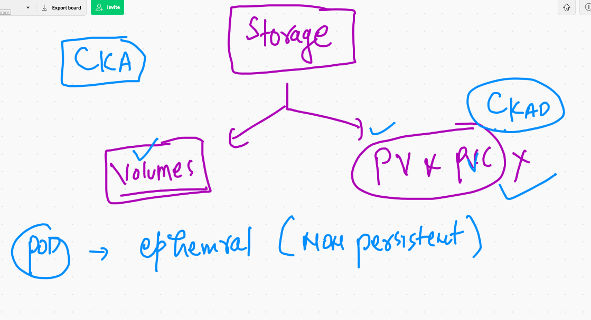
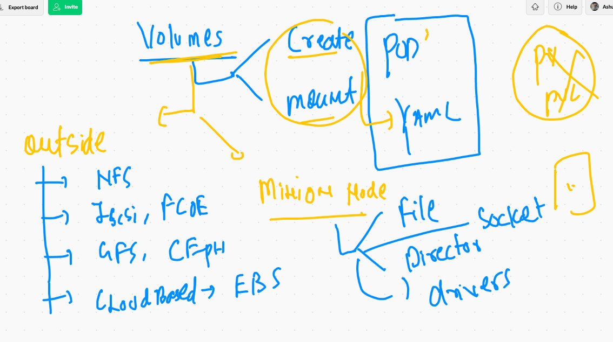
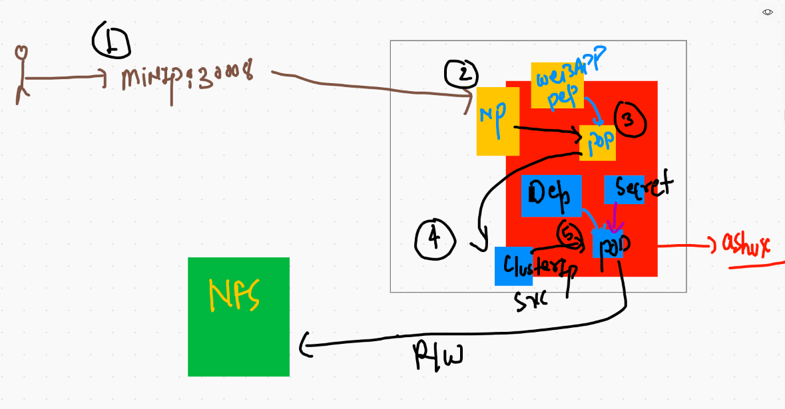

# k8s application deployment best practise 

## Single YAML file can hold all the information like NS, Deployment , SErvices

## Deployment demo best practise 

```
10008  kubectl  create  namespace  customer1ns  --dry-run=client -o yaml  >testapp.yml
10009  kubectl  create deployment  dep123 --image=dockerashu/ciscong:v2  --dry-run=client -o yaml  >>testapp.yml
10010  kubectl  create service  nodeport  ashuxvc1  --tcp 1234:80  --dry-run=client -o yaml  >>testapp.yml
10011  kubectl  apply -f  testapp.yml
10012  kubectl   get  all  -n  customer1ns 

░▒▓ ~/Desktop/mydockerimages/k8sapps ··························· kubernetes-admin@kubernetes/ashux ⎈  09:28:03 AM ▓▒░─╮
❯ kubectl   get  all  -n  customer1ns                                                                                   ─╯
❯ kubectl   get  all  -n  customer1ns
NAME                         READY   STATUS    RESTARTS   AGE
pod/dep123-b76475c7b-bmt5p   1/1     Running   0          9m1s

NAME               TYPE       CLUSTER-IP       EXTERNAL-IP   PORT(S)          AGE
service/ashuxvc1   NodePort   10.100.219.120   <none>        1234:31690/TCP   9m1s

NAME                     READY   UP-TO-DATE   AVAILABLE   AGE
deployment.apps/dep123   1/1     1            1           9m2s

NAME                               DESIRED   CURRENT   READY   AGE
replicaset.apps/dep123-b76475c7b   1         1         1       9m3s
❯ kubectl delete -f  testapp.yml
namespace "customer1ns" deleted
deployment.apps "dep123" deleted
service "ashuxvc1" deleted


```

## Deployment with private registry 



```
kubectl  create  deployment  ashudep22  --image=ciscoindia.azurecr.io/webapp:v1  --dry-run=client -o yaml >privdep.yml
```

### deploying 

```
❯ kubectl   apply -f  privdep.yml
deployment.apps/ashudep22 created
❯ kubectl   get  deploy
NAME        READY   UP-TO-DATE   AVAILABLE   AGE
ashudep22   0/1     1            0           10s
❯ kubectl   get  po
NAME                         READY   STATUS             RESTARTS   AGE
ashudep22-78d86565f6-wn7gm   0/1     ImagePullBackOff   0          27s

```

## Secret in k8s



### create secret to store docker registry credential 

```
kubectl  create  secret  docker-registry  ashusec1  --docker-server=ciscoindia.azurecr.io  --docker-username=ciscoindia    --docker-password=DGSQbiwgRYr  -n ashux
secret/ashusec1 created

```
## delete secret 

```
❯ kubectl delete all --all
pod "ashudep22-5975f5f895-6cqjv" deleted
deployment.apps "ashudep22" deleted
❯ kubectl  get  secret
NAME                  TYPE                                  DATA   AGE
ashusec1              kubernetes.io/dockerconfigjson        1      11m
default-token-8hg75   kubernetes.io/service-account-token   3      19h
❯ kubectl  delete secret  ashusec1
secret "ashusec1" deleted

```

# Storage in k8s



## Volume in k8s



## deployment of pod with Emptydir volume type 

```
❯ kubectl  apply -f  emptyvolpod.yml
pod/ashupod1 created
❯ kubectl   get  po
NAME       READY   STATUS    RESTARTS   AGE
ashupod1   1/1     Running   0          5s

```

### checking data 

```
❯ kubectl  exec -it  ashupod1 -- sh
/ # cd  /mnt/
/mnt # ls
cisco
/mnt # cd  cisco/
/mnt/cisco # ls
time.txt
/mnt/cisco # cat  time.txt 
Fri Mar 26 05:07:42 UTC 2021
Fri Mar 26 05:07:47 UTC 2021
Fri Mar 26 05:07:52 UTC 2021
Fri Mar 26 05:07:57 UTC 2021
Fri Mar 26 05:08:02 UTC 2021
Fri Mar 26 05:08:07 UTC 2021
Fri Mar 26 05:08:12 UTC 2021
Fri Mar 26 05:08:17 UTC 2021
Fri Mar 26 05:08:22 UTC 2021
Fri Mar 26 05:08:27 UTC 2021
Fri Mar 26 05:08:32 UTC 2021
/mnt/cisco # 

```

## multi container POd 

```
❯ kubectl  apply -f  emptyvolpod.yml
pod/ashupod1 created
❯ kubectl  get  pods
NAME       READY   STATUS    RESTARTS   AGE
ashupod1   2/2     Running   0          5s
❯ kubectl  exec  -it  ashupod1  -c  ashucc1  -- bash
root@ashupod1:/# cd /usr/share/nginx/html/
root@ashupod1:/usr/share/nginx/html# ls
time.txt
root@ashupod1:/usr/share/nginx/html# exit
❯ kubectl  exec  -it  ashupod1  -c  ashupod1  -- sh
/ # 
/ # 
/ # cd /mnt/cisco/
/mnt/cisco # ls
time.txt
/mnt/cisco # 

```

## creating service and access data 

```
❯ kubectl  expose pod  ashupod1  --type NodePort --port 1234 --target-port 80 --name x1svc1
service/x1svc1 exposed
❯ kubectl  get  svc
NAME     TYPE       CLUSTER-IP       EXTERNAL-IP   PORT(S)          AGE
x1svc1   NodePort   10.101.187.162   <none>        1234:31401/TCP   3s

```

## Hostpath volume type 

```
❯ kubectl apply -f  hostpath1.yml
pod/ashupod1 created
❯ kubectl  get  po
NAME       READY   STATUS    RESTARTS   AGE
ashupod1   1/1     Running   0          5s
❯ kubectl  exec -it  ashupod1 -- sh
/ # cd /mnt/cisco/
/mnt/cisco # ls
DIR_COLORS               exports                  mke2fs.conf              rsyslog.d
DIR_COLORS.256color      exports.d                modprobe.d               rwtab
DIR_COLORS.lightbgcolor  filesystems              modules-load.d           rwtab.d
GREP_COLORS              fstab                    motd                     sasl2
GeoIP.conf               gcrypt                   mtab                     scl
GeoIP.conf.default       gnu

```

# Microservice sample example 

## creating things for Mysql Db 

### creating secret 

```
kubectl  create  secret    generic  dbsec   --from-literal  pw=Ciscodb098  --dry-run=client -o yaml  >microservice.yml

```

### creating db deployment 

```
kubectl  create  deployment  ashudb  --image=mysql:5.6  --dry-run=client -o yaml  >>microservice.yml
```

### creating db service 

```
kubectl  create  service  clusterip  ashudbsvc --tcp 3306  --dry-run=client -o yaml  >>microservice.yml

```

### deployment of database deployment 

```
❯ kubectl  apply -f  microservice.yml
secret/dbsec created
deployment.apps/ashudb created
service/ashudbsvc created
❯ kubectl  get  secret
NAME                  TYPE                                  DATA   AGE
dbsec                 Opaque                                1      14s
default-token-8hg75   kubernetes.io/service-account-token   3      21h
❯ kubectl  get  deploy
NAME     READY   UP-TO-DATE   AVAILABLE   AGE
ashudb   1/1     1            1           21s
❯ kubectl  get  svc
NAME        TYPE        CLUSTER-IP      EXTERNAL-IP   PORT(S)    AGE
ashudbsvc   ClusterIP   10.110.37.230   <none>        3306/TCP   26s
```
### creating deployment for webapplication 

```
kubectl  create deployment  ashwebapp  --image=wordpress:4.8-apache  --dry-run=client -o yaml >>microservice.yml

```

### creating nodeport service for web app

```
 kubectl  create  service  nodeport  ashuwebsvc  --tcp 1234:80  --dry-run=client -o yaml >>microservice.yml
 
```

### microservice example 



## final deployment 

```
❯ kubectl  apply -f  microservice.yml --dry-run=client
secret/dbsec configured (dry run)
deployment.apps/ashudb configured (dry run)
service/ashudbsvc configured (dry run)
deployment.apps/ashwebapp created (dry run)
service/ashuwebsvc created (dry run)
❯ kubectl  apply -f  microservice.yml
secret/dbsec configured
deployment.apps/ashudb configured
service/ashudbsvc configured
deployment.apps/ashwebapp created
service/ashuwebsvc created
❯ kubectl  get deploy
NAME        READY   UP-TO-DATE   AVAILABLE   AGE
ashudb      1/1     1            1           19m
ashwebapp   1/1     1            1           19s
❯ kubectl  get  svc
NAME         TYPE        CLUSTER-IP       EXTERNAL-IP   PORT(S)          AGE
ashudbsvc    ClusterIP   10.110.37.230    <none>        3306/TCP         19m
ashuwebsvc   NodePort    10.111.238.173   <none>        1234:31549/TCP   28s
❯ kubectl  get  po
NAME                         READY   STATUS    RESTARTS   AGE
ashudb-8448dccc7f-mhj9m      1/1     Running   0          19m
ashwebapp-5c68869c5b-snqkk   1/1     Running   0          35s

```

## wordpress microservices history 

```
10089  kubectl  create  secret    generic  dbsec   --from-literal  pw=Ciscodb098  --dry-run=client -o yaml 
10090  kubectl  create  secret    generic  dbsec   --from-literal  pw=Ciscodb098  --dry-run=client -o yaml  >microservice.yml
10091  cat  microservice.yml
10092  history
10093  kubectl  create  deployment  ashudb  --image=mysql:5.6  --dry-run=client -o yaml  >>microservice.yml
10094  ls
10095  kubectl  apply -f  microservice.yml --dry-run=client  
10096  kubectl  get  deploy 
10097  history
10098  kubectl  apply -f  microservice.yml --dry-run=client  
10099  kubectl  create  service  clusterip  ashudbsvc --tcp 3306  --dry-run=client -o yaml 
10100  kubectl  create  service  clusterip  ashudbsvc --tcp 3306  --dry-run=client -o yaml  >>microservice.yml
10101  ls
10102  kubectl  config get-contexts  
10103  kubectl  apply -f  microservice.yml
10104  kubectl  get  secret
10105  kubectl  get  deploy
10106  kubectl  get  svc
10107  kubectl  get  po
10108  kubectl  logs  -f  ashudb-8448dccc7f-mhj9m 
10109  history
10110  kubectl  get  po
10111  kubectl  get  deploy
10112  history
10113  kubectl  create deployment  ashwebapp  --image=wordpress:4.8-apache  --dry-run=client -o yaml >>microservice.yml
10114  kubectl  get  svc
10115  kubectl  create  service  nodeport  ashuwebsvc  --tcp 1234:80  --dry-run=client -o yaml >>microservice.yml
10116  kubectl  apply -f  microservice.yml --dry-run=client  
10117  kubectl  apply -f  microservice.yml 
10118  kubectl  get deploy 
10119  kubectl  get  svc
10120  kubectl  get  po

```


