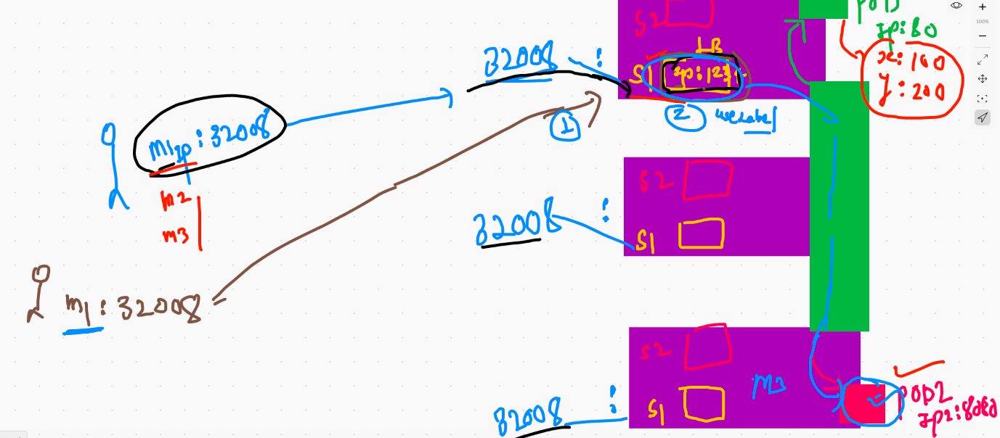
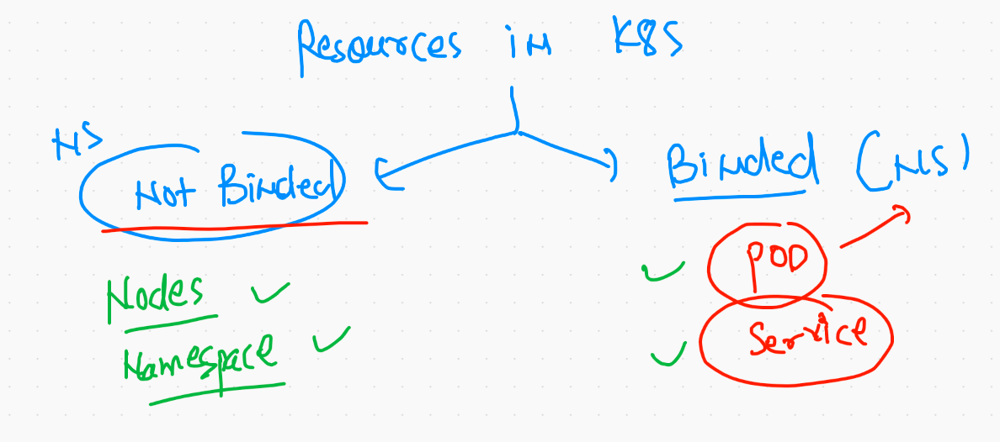

# Application deployment in k8s 

## Web application (multiweb)

### Docker based containerization 


## Passing env variable in Docker container creation time 

```
docker  run -itd --name xx1  -p 1133:80  -e x=website1  dockerashu/ciscoweb:march2021v1 

```
## Generate YAML file automatically 

### if kubectl version --client is lower than 1.18 

```
kubectl  run  ashuwebpod  --image=dockerashu/ciscoweb:march2021v1 --port=80  --restart=Never  --dry-run -o yaml
apiVersion: v1
kind: Pod
metadata:
  creationTimestamp: null
  labels:
    run: ashuwebpod
  name: ashuwebpod
spec:
  containers:
  - image: dockerashu/ciscoweb:march2021v1
    name: ashuwebpod
    ports:
    - containerPort: 80
    resources: {}
  dnsPolicy: ClusterFirst
  restartPolicy: Never
status: {}

```

### if kubectl version is 1.18 or higher 

```
❯ kubectl  run  ashuwebpod  --image=dockerashu/ciscoweb:march2021v1 --port=80    --dry-run=client -o yaml
apiVersion: v1
kind: Pod
metadata:
  creationTimestamp: null
  labels:
    run: ashuwebpod
  name: ashuwebpod
spec:
  containers:
  - image: dockerashu/ciscoweb:march2021v1
    name: ashuwebpod
    ports:
    - containerPort: 80
    resources: {}
  dnsPolicy: ClusterFirst
  restartPolicy: Always
status: {}

```

### creating yaml and storing in a file

```
kubectl  run  ashuwebpod  --image=dockerashu/ciscoweb:march2021v1 --port=80    --dry-run=client -o yaml  >webpod.yml

```

## deploy pod 

```
❯ ls
ashupod1.yaml webpod.yml
❯ kubectl  apply -f  webpod.yml
pod/ashuwebpod created
❯ kubectl  get  pods
NAME         READY   STATUS    RESTARTS   AGE
ashuwebpod   1/1     Running   0          13s
❯ kubectl  get  pods -o wide
NAME         READY   STATUS    RESTARTS   AGE   IP                NODE            NOMINATED NODE   READINESS GATES
ashuwebpod   1/1     Running   0          20s   192.168.174.201   minion-node-3   <none>           <none>


```

## Accesing application in the POd 


## Need of service  in k8s 


## service type 


## how service will find the pod 

### service will use label of POD to find 


## everything you need to remember about servie 


## final service diagram



## checking label 

```
❯ kubectl  get  po  ashuwebpod
NAME         READY   STATUS    RESTARTS   AGE
ashuwebpod   1/1     Running   0          95m
❯ kubectl  get  po  ashuwebpod  --show-labels
NAME         READY   STATUS    RESTARTS   AGE   LABELS
ashuwebpod   1/1     Running   0          95m   run=ashuwebpod
❯ kubectl  get  po   --show-labels
NAME              READY   STATUS    RESTARTS   AGE   LABELS
anilpod           1/1     Running   0          57m   run=anilpod
ashuwebpod        1/1     Running   0          95m   run=ashuwebpod
manuwebpod        1/1     Running   0          45m   run=manuwebpod
murali36webpod1   1/1     Running   0          94m   run=murali36webpod1
rahulwebpod       1/1     Running   0          94m   run=rahulwebpod
tcwebpod          1/1     Running   0          93m   run=tcwebpod
veerupod2         1/1     Running   0          58m   run=veerupod2
vjwebpod          1/1     Running   0          87m   run=vjwebpod

```

## changing label 

### change in YAML 

```
apiVersion: v1
kind: Pod
metadata:
  creationTimestamp: null
  labels: # this is for label creation of POD 
    x: helloashu # x is key and helloashu is a value 
  name: ashuwebpod # name of POD 
spec:
  containers:
  - image: dockerashu/ciscoweb:march2021v1 # docker image from Docker hub 
    name: ashuwebpod # name of container 
    ports:
    - containerPort: 80  # application port 
    resources: {}
  dnsPolicy: ClusterFirst
  restartPolicy: Always
status: {}

```

### apply the changes 

```
❯ kubectl apply -f  webpod.yml
pod/ashuwebpod configured
❯ kubectl  get  po   --show-labels
NAME              READY   STATUS    RESTARTS   AGE   LABELS
anilpod           1/1     Running   0          59m   run=anilpod
ashuwebpod        1/1     Running   0          98m   x=helloashu

```

### deploying service 

```
❯ kubectl  apply  -f  ashuwebservice.yaml
service/ashus1 created
❯ 
❯ kubectl   get  service
NAME         TYPE        CLUSTER-IP     EXTERNAL-IP   PORT(S)          AGE
ashus1       NodePort    10.96.32.247   <none>        1234:32172/TCP   11s
kubernetes   ClusterIP   10.96.0.1      <none>        443/TCP          21h

```


### access pod container to check env variable 

```
❯ kubectl  exec  -ti  ashuwebpod  -- bash
[root@ashuwebpod projects]# 
[root@ashuwebpod projects]# 
[root@ashuwebpod projects]# env
LANG=en_US.UTF-8
x=webapp
HOSTNAME=ashuwebpod
KUBERNETES_PORT_443_TCP_PROTO=tcp
KUBERNETES_PORT_443_TCP_ADDR=10.96.0.1
KUBERNETES_PORT=tcp://10.96.0.1:443
PWD=/projects
HOME=/root
KUBERNETES_SERVICE_PORT_HTTPS=443
KUBERNETES_PORT_443_TCP_PORT=443
KUBERNETES_PORT_443_TCP=tcp://10.96.0.1:443
TERM=xterm
SHLVL=1
KUBERNETES_SERVICE_PORT=443
PATH=/usr/local/sbin:/usr/local/bin:/usr/sbin:/usr/bin:/sbin:/bin
KUBERNETES_SERVICE_HOST=10.96.0.1
LESSOPEN=||/usr/bin/lesspipe.sh %s
_=/usr/bin/env
[root@ashuwebpod projects]# ls
app1  app2  app3  deploywebapp.sh
[root@ashuwebpod projects]# cat  deploywebapp.sh 
#!/bin/bash

if  [ "$x" == "website1" ]
then
    cp -rf  /projects/app1/*   /var/www/html/
    httpd -DFOREGROUND

elif  [ "$x" == "website2" ]
then
    cp -rf  /projects/app2/*   /var/www/html/
    httpd -DFOREGROUND

elif  [ "$x" == "website3" ]
then
    cp -rf  /projects/app3/*   /var/www/html/
    httpd -DFOREGROUND
else 
    echo "Wrong variable please contact to Docker Engineer !!"  >/var/www/html/index.html
    httpd -DFOREGROUND
fi

```

### changing env var and replacing the pod 

```
❯ ls
ashupod1.yaml       ashuwebservice.yaml webpod.yml
❯ kubectl   replace  -f webpod.yml  --force
pod "ashuwebpod" deleted
pod/ashuwebpod replaced
❯ kubectl  exec  -ti  ashuwebpod  -- bash
[root@ashuwebpod projects]# env
ANIL1_SERVICE_HOST=10.109.60.194
MURALI36S1_PORT_1234_TCP_ADDR=10.107.145.227
MANUSVC1_PORT_1235_TCP=tcp://10.104.239.174:1235
ANIL1_PORT=tcp://10.109.60.194:1234
MURALI36S1_SERVICE_PORT=1234
MANUSVC1_PORT=tcp://10.104.239.174:1235
VEERU_SERVICE1_SERVICE_PORT_MYPORT=1234
RAHULS1_PORT_1234_TCP_PORT=1234
MURALI36S1_SERVICE_HOST=10.107.145.227
LANG=en_US.UTF-8
MURALI36S1_PORT=tcp://10.107.145.227:1234
VEERU_SERVICE1_SERVICE_PORT=1234
x=website1

```
## creating  service  

```
❯ kubectl   create  service  nodeport  s1  --tcp  1234:80   --dry-run=client -o yaml
apiVersion: v1
kind: Service
metadata:
  creationTimestamp: null
  labels:
    app: s1
  name: s1
spec:
  ports:
  - name: 1234-80
    port: 1234
    protocol: TCP
    targetPort: 80
  selector:
    app: s1
  type: NodePort
status:
  loadBalancer: {}
❯ kubectl   create  service  nodeport  s1  --tcp  1234:80   --dry-run=client -o yaml  >s1.yml

```

### TO delete all

```
❯ kubectl  delete all --all
pod "anilpod" deleted
pod "ashuwebpod" deleted
pod "manuwebpod" deleted
pod "manuwebpod2" deleted
pod "rahulwebpod" deleted
pod "tcwebpod" deleted
pod "veerupod2" deleted
pod "vjwebpod" deleted
pod "vjwebpod2" deleted
service "anil1" deleted
service "ashus1" deleted
service "kubernetes" deleted
service "manusvc1" deleted
service "manusvc2" deleted
service "murali36s1" deleted
service "rahuls1" deleted
service "s1" deleted

```


### Merging  pod  and servie YMAL in same file 


```
❯ kubectl  run  ashuwebpod  --image=dockerashu/ciscoweb:march2021v1 --port=80    --dry-run=client -o yaml  >webpod.yml
❯ 
❯ kubectl  create  service   nodeport  ss11  --tcp 1234:80 --dry-run=client  -o yaml  >>webpod.yml

```
# namesapce  

##  4 default namespace 


##

```
❯ kubectl  get   namespace
NAME              STATUS   AGE
default           Active   23h
kube-node-lease   Active   23h
kube-public       Active   23h
kube-system       Active   23h

```

## k8s internal component are running 

```
❯ kubectl  get  pods  -n  kube-system
NAME                                       READY   STATUS    RESTARTS   AGE
calico-kube-controllers-69496d8b75-d48rj   1/1     Running   1          23h
calico-node-d4rjc                          1/1     Running   1          23h
calico-node-d8z88                          1/1     Running   1          23h
calico-node-qxtfw                          1/1     Running   1          23h
calico-node-sg4zz                          1/1     Running   1          23h
coredns-74ff55c5b-4pv8k                    1/1     Running   1          23h
coredns-74ff55c5b-9fc77                    1/1     Running   1          23h
etcd-master-node                           1/1     Running   1          23h
kube-apiserver-master-node                 1/1     Running   2          23h
kube-controller-manager-master-node        1/1     Running   1          23h
kube-proxy-cbbn4                           1/1     Running   1          23h
kube-proxy-g9q8n                           1/1     Running   1          23h
kube-proxy-k2cpq                           1/1     Running   1          23h
kube-proxy-m9298                           1/1     Running   1          23h
kube-scheduler-master-node                 1/1     Running   1          23h

```

## namespace more info 



## creating custom namespace 

```
❯ kubectl  create  namespace  ashux
namespace/ashux created
❯ kubectl  get  ns
NAME              STATUS   AGE
anilnamespace     Active   2s
ashux             Active   7s
default           Active   23h
kube-node-lease   Active   23h
kube-public       Active   23h

```


## depoy app in custom namesapce 

```
❯ kubectl  apply -f  webpod.yml  -n  ashux
pod/ashuwebpod created
service/ss11 created
❯ 
❯ kubectl  get  po
No resources found in default namespace.
❯ kubectl  get  po   -n ashux
NAME         READY   STATUS    RESTARTS   AGE
ashuwebpod   1/1     Running   0          19s
❯ kubectl  get  svc   -n ashux
NAME   TYPE       CLUSTER-IP     EXTERNAL-IP   PORT(S)          AGE
ss11   NodePort   10.111.26.30   <none>        1234:31767/TCP   22s

```


===
```
❯ kubectl  delete all  --all -n ashux
pod "ashuwebpod" deleted
service "ss11" deleted
❯ kubectl  get  all  -n ashux
No resources found in ashux namespace.


```
