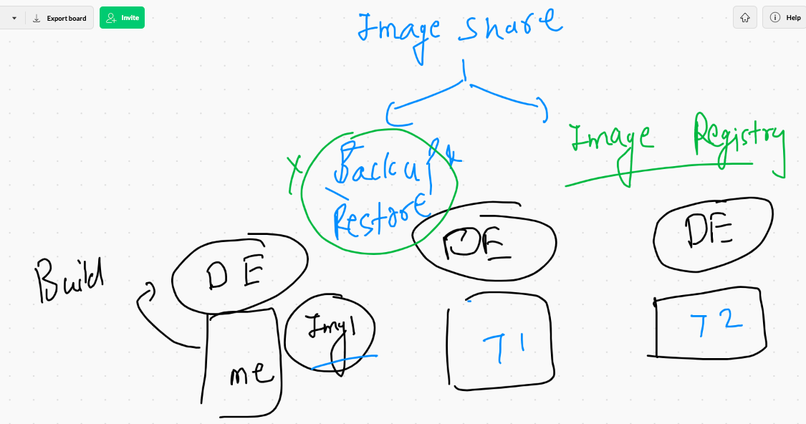
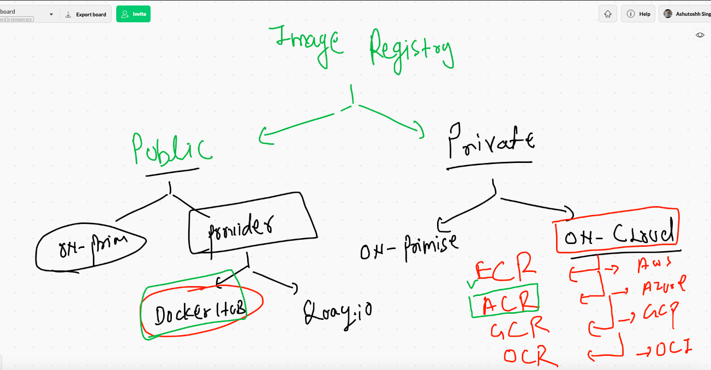

# Container Isolation 

## Namespaces 


## Cgroups to put the limit on resources for each container 


# Cgroups demo 

## creating container 

```
❯ docker  run -itd --name ashux1 alpine ping 127.0.0.1
cf48901093b8a1af44987b1ad6bb96f30bcb6a1505c17d4d188d58ca8cfb57cb
❯ docker  ps
CONTAINER ID   IMAGE     COMMAND            CREATED         STATUS         PORTS     NAMES
cf48901093b8   alpine    "ping 127.0.0.1"   6 seconds ago   Up 3 seconds             ashux1

```

## checking current resources 

```
> docker stats ashux1 
> 
CONTAINER ID   NAME      CPU %     MEM USAGE / LIMIT   MEM %     NET I/O      BLOCK I/O   PIDS
cf48901093b8   ashux1    0.01%     608KiB / 7.69GiB    0.01%     1.2kB / 0B   0B / 0B     1

```

### creating container with limited resources 

```
❯ docker  run -itd --name ashux2  --memory 100m --cpu-shares=20  alpine ping 127.0.0.1
679c4c18e18c7bd2d3dab40674431abaac8cfd9451aaaa3467db1950d3e8dc56

==
checking stats 

docker stats 

CONTAINER ID   NAME         CPU %     MEM USAGE / LIMIT    MEM %     NET I/O           BLOCK I/O   PIDS
679c4c18e18c   ashux2       0.01%     628KiB / 100MiB      0.61%     726B / 0B         0B / 0B     1
70f414e6437a   murali36x1   0.03%     748KiB / 7.69GiB     0.01%     14.9kB / 13.8kB   0B / 0B     2

```

## restart policy 

```
 docker  run -itd --name ashux2  --memory 100m --cpu-shares=20  --restart always alpine ping 127.0.0.1 

❯ docker  inspect  ashux3  -f '{{.HostConfig.RestartPolicy}}'
{always 0}
❯ docker  inspect  ashux3  -f '{{.HostConfig.RestartPolicy.Name}}'
always
❯ docker  inspect  ashux1  -f '{{.HostConfig.RestartPolicy.Name}}'
no

```

## Containerization of python Flask web application 

### Clone git code 

```
❯ git clone  https://github.com/redashu/flaskapp
Cloning into 'flaskapp'...
remote: Enumerating objects: 20, done.
remote: Counting objects: 100% (20/20), done.
remote: Compressing objects: 100% (14/14), done.
remote: Total 20 (delta 6), reused 9 (delta 2), pack-reused 0
Unpacking objects: 100% (20/20), 2.99 KiB | 76.00 KiB/s, done.
❯ ls
flaskapp   

```

### Create Dockerfile 

```
cat ashu.dockerfile

FROM ubuntu
MAINTAINER  ashutoshh@linux.com
RUN apt update
RUN apt install python3 -y
RUN     apt install python3-pip -y 
# to install flask we need pip3 command 
RUN mkdir /webapp
# here i am creating a folder to store my Flask application 
COPY  . /webapp/
WORKDIR /webapp
# changing directory 
RUN pip3 install -r requirements.txt
# install python Flask framework 
EXPOSE 5000
# is optional part but you set some default port with container IP 
CMD ["python3","demo.py"]

```

### building docker image for flask

```
docker  build  -t  ashuflask:v001  -f  ashu.dockerfile  .

```

## few more discussion on docker build 

```
10090  docker  build -t  ashuflask:v001  -f  ashu.dockerfile  .
10091  docker  history  ashuflask:v001
10092  ls
10093  docker  build -t  ashuflask:v002  -f  test.dockerfile  .
10094  history
10095  docker  build -t  ashuflask:v003  -f  test.dockerfile  .
10096  docker  inspect  ashuflask:v003  
10097  docker  inspect  ashuflask:v003    |   grep -i ashu
10098  history
10099  docker  images
10100  history
10101  docker history  ashuflask:v003
10102  docker history  ubuntu
10103  history
10104  docker history  ashuflask:v001
10105  docker  tag  5494070a8c2e   common:flasklayer

```

## Creating container 

```
❯ docker  run  -itd  --name ashuc1  -p  1234:5000  ashuflask:v001
4425e0d2b504fdf40a2993f36dfe790554e83ea2e440da063827b79c61806fd8
❯ docker  ps
CONTAINER ID   IMAGE            COMMAND             CREATED         STATUS         PORTS                    NAMES
4425e0d2b504   ashuflask:v001   "python3 demo.py"   5 seconds ago   Up 3 seconds   0.0.0.0:1234->5000/tcp   ashuc1
❯ docker  ps

```

# To share the docker image you build 

## methods 




## image registry info 



## reality of image name 


## pushing image to docker hub 

### steps 

```
docker   tag   ashuflask:v001   dockerashu/ashuflask:v001

---

❯ docker  login
Login with your Docker ID to push and pull images from Docker Hub. If you don't have a Docker ID, head over to https://hub.docker.com to create one.
Username: dockerashu
Password: 
Login Succeeded

----


❯ docker   push   dockerashu/ashuflask:v001
The push refers to repository [docker.io/dockerashu/ashuflask]
e42dd56b8edf: Pushed 
452ba4bc787d: Pushed 
4e4ced0acece: Pushed 
dd45ee3e8e5c: Pushed 
45d11b443936: Pushed 
a97512b69db7: Pushed 
c20d459170d8: Mounted from library/ubuntu 
db978cae6a05: Mounted from library/ubuntu 
aeb3f02e9374: Mounted from library/ubuntu 
v001: digest: sha256:138f8b1ec36a4ec091a5692909c3ed0cbdfcc071fa6b14d08c4e352a5b2f52dd size: 2204

----

 docker  logout
Removing login credentials for https://index.docker.io/v1/

```

# Multi stage Docker image 

### Google Distroless

https://github.com/GoogleContainerTools/distroless

```

FROM centos AS mybuilder 
MAINTAINER  ashutoshh
RUN mkdir /code
COPY hello.py  /code/
WORKDIR /code
RUN chmod +x hello.py
# here i am making code executable by permission 
# above process is for only copy and execute permission to code

FROM gcr.io/distroless/python3
COPY --from=mybuilder  /code   /code1
WORKDIR /code1
CMD ["./hello.py"]

```

# Docker networking 


## checking default bridges

```
❯ docker  network   ls
NETWORK ID     NAME      DRIVER    SCOPE
0a15a8e8f66f   bridge    bridge    local
ce1e5d5672aa   host      host      local
f4e51e88ce60   none      null      local


```

## exploring bridge 
```
❯ docker  network   inspect  bridge
[
    {
        "Name": "bridge",
        "Id": "0a15a8e8f66ff96295479b1948c0c64109107bc7eabfa3f5da208bf59cbc1da0",
        "Created": "2021-03-23T04:33:43.303576733Z",
        "Scope": "local",
        "Driver": "bridge",
        "EnableIPv6": false,
        "IPAM": {
            "Driver": "default",
            "Options": null,
            "Config": [
                {
                    "Subnet": "172.17.0.0/16",
                    "Gateway": "172.17.0.1"
                }
            ]
        },
        "Internal": false,
        "Attachable": false,
        "Ingress": false,
        "ConfigFrom": {
            "Network": ""
        },
        "ConfigOnly": false,
        "Containers": {},
        "Options": {
            "com.docker.network.bridge.default_bridge": "true",
            "com.docker.network.bridge.enable_icc": "true",
            "com.docker.network.bridge.enable_ip_masquerade": "true",
            "com.docker.network.bridge.host_binding_ipv4": "0.0.0.0",
            "com.docker.network.bridge.name": "docker0",
            "com.docker.network.driver.mtu": "1500"
        },
        "Labels": {}
    }
]

```
## checking all the containers connected to Docker0 {bridge}

```
❯ docker  network   inspect  bridge
[
    {
        "Name": "bridge",
        "Id": "0a15a8e8f66ff96295479b1948c0c64109107bc7eabfa3f5da208bf59cbc1da0",
        "Created": "2021-03-23T04:33:43.303576733Z",
        "Scope": "local",
        "Driver": "bridge",
        "EnableIPv6": false,
        "IPAM": {
            "Driver": "default",
            "Options": null,
            "Config": [
                {
                    "Subnet": "172.17.0.0/16",
                    "Gateway": "172.17.0.1"
                }
            ]
        },
        "Internal": false,
        "Attachable": false,
        "Ingress": false,
        "ConfigFrom": {
            "Network": ""
        },
        "ConfigOnly": false,
        "Containers": {
            "19df055f540f8c63eb13fbf99badb862fbd7d388112a66ade5dafac7cdb84508": {
                "Name": "murali36",
                "EndpointID": "bbb7a815340b0c001c85fd06e9a5506d650e07d4e32f256c6fa1c514161de1ed",
                "MacAddress": "02:42:ac:11:00:05",
                "IPv4Address": "172.17.0.5/16",
                "IPv6Address": ""
            },
            "29185ef7545a514ad8cfb475e7e7445e9efaa6db21a9020d251b56e5defc75d5": {
                "Name": "anilc9",
                "EndpointID": "ac423356bb3febf3028c50a4c9c38fa9083a5f0205b3a6f2728a657d567d0247",
                "MacAddress": "02:42:ac:11:00:03",
                "IPv4Address": "172.17.0.3/16",
                "IPv6Address": ""
            },
            "89f48b3ebe8c50c279b73e0d615ec21d57e929f49536890a978b84dcf38be1f2": {
                "Name": "ashuc1",
                "EndpointID": "89190c992a1d522a102a54883b7d5e0a8976967e701090a28a91b47952753057",
                "MacAddress": "02:42:ac:11:00:02",
                "IPv4Address": "172.17.0.2/16
                
   ```
   
   
   ### checking a particular container ip 
   
   ```
   ❯ docker  inspect  ashuc1  -f '{{.NetworkSettings.IPAddress}}'
172.17.0.2

```
### Containers with in same bridge can connect to each other

```
❯ docker  exec -it  ashuc1 bash
[root@89f48b3ebe8c /]# ping 172.17.0.3
PING 172.17.0.3 (172.17.0.3) 56(84) bytes of data.
64 bytes from 172.17.0.3: icmp_seq=1 ttl=255 time=0.094 ms
64 bytes from 172.17.0.3: icmp_seq=2 ttl=255 time=0.057 ms
64 bytes from 172.17.0.3: icmp_seq=3 ttl=255 time=0.061 ms
^C
--- 172.17.0.3 ping statistics ---
3 packets transmitted, 3 received, 0% packet loss, time 40ms
rtt min/avg/max/mdev = 0.057/0.070/0.094/0.019 ms

```

## To access container application from outside DE host 
### we can use port forwarding 


## container with port forwarding 

```
10181  docker  build -t  httpd:v1 . 
10182  docker  images
10183  docker run -itd --name ashuc2  -p 8877:80  httpd:v1 
10184  docker run -itd --name ashuc2  -p 8879:80 --restart always  httpd:v1 
10185  docker run -itd --name ashuc3  -p 8879:80 --restart always  httpd:v1 

```

### None Bridge 

```
❯ docker  network  ls
NETWORK ID     NAME      DRIVER    SCOPE
0a15a8e8f66f   bridge    bridge    local
ce1e5d5672aa   host      host      local
f4e51e88ce60   none      null      local
❯ docker  run  -it --rm   --network none  alpine  sh
Unable to find image 'alpine:latest' locally
latest: Pulling from library/alpine
ba3557a56b15: Pull complete 
Digest: sha256:a75afd8b57e7f34e4dad8d65e2c7ba2e1975c795ce1ee22fa34f8cf46f96a3be
Status: Downloaded newer image for alpine:latest
/ # 
/ # 
/ # 
/ # ping google.com
ping: bad address 'google.com'
/ # ^C
/ # ping 172.17.0.3
PING 172.17.0.3 (172.17.0.3): 56 data bytes
ping: sendto: Network unreachable
/ # ifconfig 
lo        Link encap:Local Loopback  
          inet addr:127.0.0.1  Mask:255.0.0.0
          UP LOOPBACK RUNNING  MTU:65536  Metric:1
          RX packets:0 errors:0 dropped:0 overruns:0 frame:0
          TX packets:0 errors:0 dr
          
 ```
 
 
 ## cmd vs entrypoint 
 
 ```
 ❯ docker run -itd --name x1   cmdentry:v4
648deff97c339f7bdba1cdc92fe2297af9ed711f231cddd30ac6e1ccef3adb79
❯ docker  ps
CONTAINER ID   IMAGE         COMMAND         CREATED         STATUS         PORTS     NAMES
648deff97c33   cmdentry:v4   "ping fb.com"   5 seconds ago   Up 2 seconds             x1
❯ 
❯ docker run -itd --name x2   cmdentry:v4  google.com
b50229ff3402f9a9ad2f9142e8edd42ec6129b565615d78ce6aed94e545c79bb
❯ docker  ps
CONTAINER ID   IMAGE         COMMAND             CREATED          STATUS          PORTS     NAMES
b50229ff3402   cmdentry:v4   "ping google.com"   6 seconds ago    Up 4 seconds              x2
648deff97c33   cmdentry:v4   "ping fb.com"       39 seconds ago   Up 36 seconds             x1
❯ 
❯ 
❯ docker run -itd --name x3  --entrypoint  sleep    cmdentry:v4  1000
a1eec8abb618b87441563c71f1291bba61e55a0374fcbc42e1f40dcccca7d374
❯ docker  ps
CONTAINER ID   IMAGE         COMMAND             CREATED              STATUS              PORTS     NAMES
a1eec8abb618   cmdentry:v4   "sleep 1000"        4 seconds ago        Up 2 seconds                  x3
b50229ff3402   cmdentry:v4   "ping google.com"   35 seconds ago       Up 33 seconds                 x2
648deff97c33   cmdentry:v4   "ping fb.com"       About a minute ago   Up About a minute             x1


```

### cmd & entrypoint both can be replaced -- cmd is the last argument while entrypoint can be changed using --entryopint 

```
 <<X explanation
heredoc> 1. docker run -itd --name x1  --entrypoint ping cmdentry:v4  fb.com 
heredoc>  docker  run -itd  --name x1  --entrypoint  "ping fb.com"  cmdentrypont:v4 
heredoc>  docker run -itd --name x1  cmdentry:v4  ping fb.com 

```

## Docker multi bridge 


# Custom bridge creation 

```
❯ docker   network  create  ashubr1   --subnet   192.168.1.0/24
c38b42422e191dd23f710121afe04015e971264c413c08855bd0db2b92f58ff5
❯ docker network  ls
NETWORK ID     NAME      DRIVER    SCOPE
c38b42422e19   ashubr1   bridge    local
0a15a8e8f66f   bridge    bridge    local
ce1e5d5672aa   host      host      local
f4e51e88ce60   none      null      local
❯ docker network  ls
NETWORK ID     NAME      DRIVER    SCOPE
c38b42422e19   ashubr1   bridge    local
0a15a8e8f66f   bridge    bridge    local
ce1e5d5672aa   host      host      local
f4e51e88ce60   none      null      local
79add9526b9c   veerun1   bridge    local
❯ docker network  inspect  ashubr1
[
    {
        "Name": "ashubr1",
        "Id": "c38b42422e191dd23f710121afe04015e971264c413c08855bd0db2b92f58ff5",
        "Created": "2021-03-23T11:00:06.792571278Z",
        "Scope": "local",
        "Driver": "bridge",
        "EnableIPv6": false,
        "IPAM": {
            "Driver": "default",
            "Options": {},
            "Config": [


```

### creating containers in custom bridge 

```
10250  docker  run  -itd  --name ashuxc1  --network  ashubr1  alpine ping 127.0.0.1 
10251  docker  run  -itd  --name ashuxc2   --network  ashubr1 --ip 192.168.1.100  alpine ping 127.0.0.1 
❯ docker  ps
CONTAINER ID   IMAGE     COMMAND            CREATED          STATUS          PORTS     NAMES
f969ad352781   alpine    "ping 127.0.0.1"   31 seconds ago   Up 29 seconds             ashuxc2
9bc1b6c3347c   alpine    "ping 127.0.0.1"   56 seconds ago   Up 54 seconds             ashuxc1
❯ docker  exec -it  ashuxc1  sh
/ # ifconfig 
eth0      Link encap:Ethernet  HWaddr 02:42:C0:A8:01:02  
          inet addr:192.168.1.2  Bcast:192.168.1.255  Mask:255.255.255.0
          UP BROADCAST RUNNING MULTICAST  MTU:1500  Metric:1
          RX packets:15 errors:0 dropped:0 overruns:0 frame:0
          TX packets:0 errors:0 dropped:0 overruns:0 carrier:0
          collisions:0 txqueuelen:0 
          RX bytes:1242 (1.2 KiB)  TX bytes:0 (0.0 B)

lo        Link encap:Local Loopback  
          inet addr:127.0.0.1  Mask:255.0.0.0
          UP LOOPBACK RUNNING  MTU:65536  Metric:1
          RX packets:142 errors:0 dropped:0 overruns:0 frame:0
          TX packets:142 errors:0 dropped:0 overruns:0 carrier:0
          collisions:0 txqueuelen:1000 
          RX bytes:11928 (11.6 KiB)  TX bytes:11928 (11.6 KiB)

/ # ping  192.168.1.100
PING 192.168.1.100 (192.168.1.100): 56 data bytes
64 bytes from 192.168.1.100: seq=0 ttl=255 time=0.158 ms
64 bytes from 192.168.1.100: seq=1 ttl=255 time=0.107 ms
^C
--- 192.168.1.100 ping statistics ---
2 packets transmitted, 2 packets received, 0% packet loss
round-trip min/avg/max = 0.107/0.132/0.158 ms
/ # ping  ashuxc2
PING ashuxc2 (192.168.1.100): 56 data bytes
64 bytes from 192.168.1.100: seq=0 ttl=255 time=0.079 ms
64 bytes from 192.168.1.100: seq=1 ttl=255 time=0.102 ms
64 bytes from 192.168.1.100: seq=2 ttl=255 time=0

```

## a container can be part of multiple bridges 

```
10267  docker  network ls
10268  docker  network  connect  murali36br1 ashuxc1 
10269  docker  exec -it  ashuxc1  sh 
❯ docker  network  disconnect  murali36br1 ashuxc1
❯ docker  exec -it  ashuxc1  sh
/ # ifconfig 
eth0      Link encap:Ethernet  HWaddr 02:42:C0:A8:01:02  
          inet addr:192.168.1.2  Bcast:192.168.1.255  Mask:255.255.255.0
          UP BROADCAST RUNNING MULTICAST  MTU:1500  Metric:1
          RX packets:32 errors:0 dropped:0 overruns:0 frame:0
          TX packets:14 errors:0 dropped:0 overruns:0 carrier:0
          collisions:0 txqueuelen:0 
          RX bytes:2782 (2.7 KiB)  TX bytes:1030 (1.0 KiB)

lo        Link encap:Local Loopback  
          inet addr:127.0.0.1  Mask:255.0.0.0
          UP LOOPBACK RUNNING  MTU:65536  Metric:1
          RX packets:1500 errors:0 dropped:0 overruns:0 frame:0
          TX packets:1500 errors:0 dropped:0 overruns:0 carrier:0
          collisions:0 txqueuelen:1000 
          RX bytes:125963 (123.0 KiB)  TX bytes:125963 (123.0 KiB)

/ # 

```


