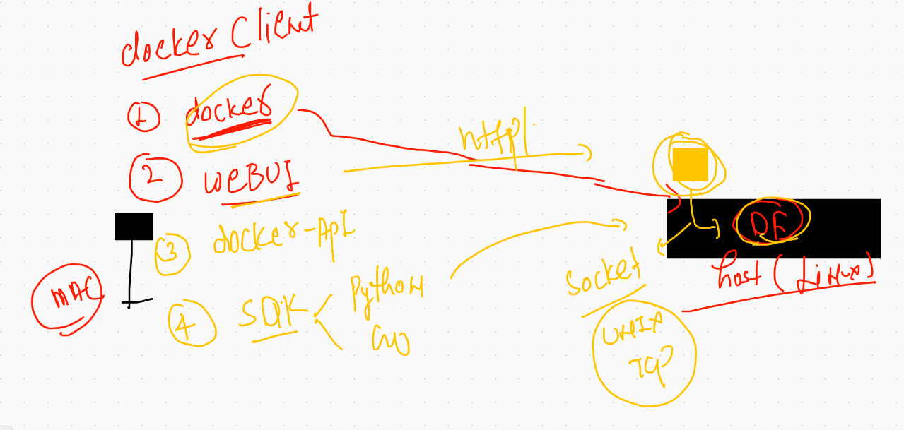

# Everything you need to know in COntainerization process

## things not to avoid 


## Use custom network 


# Docker  volume 


## volume options 


## creating and listing volumes 

```
❯ docker  volume   create  ashuvol1
ashuvol1
❯ docker  volume  ls
DRIVER    VOLUME NAME
local     anil-vol
local     ashuvol1
local     manuvol1
local     vishalvol1

```

### checking volume location on docker host 

```
❯ docker  volume  inspect  ashuvol1
[
    {
        "CreatedAt": "2021-03-24T04:16:53Z",
        "Driver": "local",
        "Labels": {},
        "Mountpoint": "/var/lib/docker/volumes/ashuvol1/_data",
        "Name": "ashuvol1",
        "Options": {},
        "Scope": "local"
    }
]


```
### creating container with volume attached 

```
❯ docker  run  -itd  --name ashuc1 -v  ashuvol1:/mnt/mydata:rw   alpine  sh
eb4b29b8bec83c547e8ace4c998f00bb8d1ec817ac8a2692630ba59c0363165d
❯ docker  ps
CONTAINER ID   IMAGE     COMMAND                  CREATED          STATUS                  PORTS     NAMES
f14a62be18bb   alpine    "sh"                     2 seconds ago    Up Less than a second             thejaswiC1
042095e32577   alpine    "sh"                     4 seconds ago    Up 2 seconds                      vijayc1
dabd9c476fa7   alpine    "sh"                     5 seconds ago    Up 3 seconds                      anilc1
19fb59c6f005   alpine    "sh"                     8 seconds ago    Up 6 seconds                      murali36c1
eb4b29b8bec8   alpine    "sh"                     8 seconds ago    Up 6 seconds                      ashuc1
88fed1441bc1   ubuntu    "/bin/bash -c 'apt-g…"   13 minutes ago   Up 13 minutes                     magical_cohen
❯ docker  exec  -it  ashuc1  sh
/ # cd  /mnt/
/mnt # ls
mydata
/mnt # cd  mydata/
/mnt/mydata # ls
/mnt/mydata # mkdir  hello cisco 
/mnt/mydata # ls
cisco  hello
/mnt/mydata # echo   hiii all  >hii.txt
/mnt/mydata # ls
cisco    hello    hii.txt


```

## mounting the same volume in another container with RO permission 

```
 docker  run  -itd  --name ashuc3 -v  ashuvol1:/mnt/ok:ro  busybox  sh 
```

## more volume demos

```
10316  docker  run -itd --name xashuc1  -v  /mydisk/hello1:/mnt/data   centos  bash 
10317  docker  exec -it  xashuc1  bash 
10318  docker  run -itd --name xashuc2  -v  /etc:/myhostetc:ro    centos  bash 
10319  docker  exec -it  xashuc2 bash 
10320  docker  volume  ls
❯  docker  run -it --rm   -v  /etc/group:/mygroup.txt:ro    centos  bash
[root@f2c6f871bef5 /]# cat  /mygroup.txt 
root:x:0:
bin:x:1:
daemon:x:2:
sys:x:3:
adm:x:4:ec2-user
tty:x:5:

```

## Docker client options 



## portainer as docker engine webui

```
docker  run -itd  --name webui --restart always -v  /var/run/docker.sock:/var/run/docker.sock -p 9000:9000 portainer/portainer
Unable to find image 'portainer/portainer:latest' locally
latest: Pulling from portainer/portainer
94cfa856b2b1: Pull complete 
49d59ee0881a: Pull complete 
a2300fd28637: Pull complete 

```

# Docker compose 

## a new way of managing and creating and managing  all docker componets like network , volume , containers [orchestration tool]
## its a client side tool 


## by default docker desktop has installed compose also 

### to install manually you can use below link

[compose install](https://docs.docker.com/compose/install/)

## checking compose version on client side

```
❯ docker-compose -v
docker-compose version 1.28.5, build c4eb3a1f

```

## COmpose example 1 

```
version: '3.8' # this is compose file version 
# Network creation section 
networks: # for creating network 
 ashubr111:  # name of bridge it will automatically pick subnet 

#  volume creation section 
volumes: #  this is for creating volumes
 ashuvolx1:  # name of volume 

# About your application 
services:  # to define everything about containers 
 ashutest1:  # each service will have its own container information 
  image: alpine
  container_name: ashuxxc1 
  command: ping fb.com
  networks:
   - ashubr111 
  volumes:
   - ashuvolx1:/mnt/ddx1 
  restart: always # restart policy 
 
 ```
 
 ## running file 
 
 ```
 ❯ ls
docker-compose.yaml
❯ docker-compose up  -d
Creating network "mycompose_ashubr111" with the default driver
Creating volume "mycompose_ashuvolx1" with default driver
Creating ashuxxc1 ... done
❯ docker-compose  ps
  Name       Command     State   Ports
--------------------------------------
ashuxxc1   ping fb.com   Up           
❯ docker-compose  images
Container   Repository    Tag       Image Id       Size  
---------------------------------------------------------
ashuxxc1    alpine       latest   28f6e2705743   5.613 MB

```

### compose command history 

```
10331  docker-compose up  -d
10332  docker-compose  ps
10333  docker-compose  images
10334  docker-compose  logs
10335  docker-compose  logs -f
10336  docker-compose  ps
10337  history
10338  docker-compose  stop
10339  docker-compose  ps
10340  docker-compose  start
10341  docker-compose  ps
10342  docker-compose  kill
10343  docker-compose  ps
10344  docker-compose  start
10345  docker-compose  down
10346  docker-compose  ps

```

## example 2 

```
version: '3.8'
networks:
 ashubrxcb1:
services:
 mynewimg:
  image: dockerashu/webserver:v1 
  build: . # will call Dockerfile on current location 
  container_name: ashuccc1
  ports:
   - 1133:80
  restart: always
  
 ```
 
 ## running 
 
 ```
 docker-compose -f  hello.yaml up  -d
10350  docker-compose -f  hello.yaml ps
10351  docker-compose -f  hello.yaml down
10352  docker-compose -f  hello.yaml up  -d
10353  docker-compose -f  hello.yaml ps


```

## application depeloyment common problems in Docker engine 


# APplication orchestration engine 


## reality of Kubernetes & container concept 


## Kubernetes (k8s) high level arch 


## Master node componet 


## Minion side component 


## k8s cluster deployment 


## INstalling minikube in Mac 

```
❯ curl -Lo ./kind https://kind.sigs.k8s.io/dl/v0.10.0/kind-darwin-amd64
  % Total    % Received % Xferd  Average Speed   Time    Time     Time  Current
                                 Dload  Upload   Total   Spent    Left  Speed
100    99  100    99    0     0    117      0 --:--:-- --:--:-- --:--:--   117
100   625  100   625    0     0    470      0  0:00:01  0:00:01 --:--:--   470
100 7222k  100 7222k    0     0  1673k      0  0:00:04  0:00:04 --:--:-- 2711k
❯ minikube version
minikube version: v1.18.1
commit: 09ee84d530de4a92f00f1c5dbc34cead092b95bc

```
## Understanding minikube 


## creating cluster using minikube 

```
❯ minikube  start  --driver=docker
😄  minikube v1.18.1 on Darwin 11.2.3
✨  Using the docker driver based on existing profile
👍  Starting control plane node minikube in cluster minikube
🤷  docker "minikube" container is missing, will recreate.
🔥  Creating docker container (CPUs=2, Memory=1990MB) ...
🐳  Preparing Kubernetes v1.20.2 on Docker 20.10.3 ...
🔎  Verifying Kubernetes components...
    ▪ Using image gcr.io/k8s-minikube/storage-provisioner:v4
🌟  Enabled addons: storage-provisioner, default-storageclass
🏄  Done! kubectl is now configured to use "minikube" cluster and "default" namespace by default

```

## check minikube cluster status 

```
❯ minikube  status
minikube
type: Control Plane
host: Running
kubelet: Running
apiserver: Running
kubeconfig: Configured
timeToStop: Nonexistent


```

## connecting to k8s cluster using kubectl 

```
❯ kubectl   version
Client Version: version.Info{Major:"1", Minor:"20", GitVersion:"v1.20.2", GitCommit:"faecb196815e248d3ecfb03c680a4507229c2a56", GitTreeState:"clean", BuildDate:"2021-01-13T13:28:09Z", GoVersion:"go1.15.5", Compiler:"gc", Platform:"darwin/amd64"}
Server Version: version.Info{Major:"1", Minor:"20", GitVersion:"v1.20.2", GitCommit:"faecb196815e248d3ecfb03c680a4507229c2a56", GitTreeState:"clean", BuildDate:"2021-01-13T13:20:00Z", GoVersion:"go1.15.5", Compiler:"gc", Platform:"linux/amd64"}


```


====

```
❯ kubectl  cluster-info
Kubernetes control plane is running at https://127.0.0.1:55006
KubeDNS is running at https://127.0.0.1:55006/api/v1/namespaces/kube-system/services/kube-dns:dns/proxy

To further debug and diagnose cluster problems, use 'kubectl cluster-info dump'.


```

=====

```
❯ kubectl  get  nodes
NAME       STATUS   ROLES                  AGE   VERSION
minikube   Ready    control-plane,master   14d   v1.20.2


```

## troubleshooting for minikube 

```
❯ minikube stop
✋  Stopping node "minikube"  ...
🛑  Powering off "minikube" via SSH ...
🛑  1 nodes stopped.
❯ minikube start
😄  minikube v1.18.1 on Darwin 11.2.3
✨  Using the docker driver based on existing profile
👍  Starting control plane node minikube in cluster minikube
🔄  Restarting existing docker container for "minikube" ...
🐳  Preparing Kubernetes v1.20.2 on Docker 20.10.3 ...
🔎  Verifying Kubernetes components...
    ▪ Using image gcr.io/k8s-minikube/storage-provisioner:v4
🌟  Enabled addons: default-storageclass, storage-provisioner
🏄  Done! kubectl is now configured to use "minikube" cluster and "default" namespace by default
❯ kubectl  get  nodes
NAME       STATUS   ROLES                  AGE   VERSION
minikube   Ready    control-plane,master   14d   v1.20.2

```

# K8s multinode cluster Installation 

## steps to perform in all the Nodes 

### step 1 

hostname setup for all nodes

### step 2 

```
swapoff -a
yum install docker -y
systemctl  start  docker  
systemctl enable docker  

# to enable feature for any CNI 

modprobe br_netfilter
echo '1' > /proc/sys/net/bridge/bridge-nf-call-iptables


cat  <<EOF  >/etc/yum.repos.d/kube.repo
[kube]
baseurl=https://packages.cloud.google.com/yum/repos/kubernetes-el7-x86_64
gpgcheck=0
EOF


yum install kubeadm  -y
systemctl enable --now  kubelet 

```

## run script 

##  Steps that only Need to be performed on Master Node 


## connecting remote. k8s cluseter

```
❯ cd  Desktop
❯ ls
DevopsSRE      admin.conf     ciscomarch22   k8sdep.png     minion.png     techienest
PHD            backup         helm2          minikube.png   mydockerimages webapp_dev
❯ 
❯ kubectl   get  nodes
NAME       STATUS   ROLES                  AGE   VERSION
minikube   Ready    control-plane,master   14d   v1.20.2
❯ kubectl   get  nodes  --kubeconfig  admin.conf
NAME            STATUS   ROLES                  AGE     VERSION
master-node     Ready    control-plane,master   6m9s    v1.20.5
minion-node-1   Ready    <none>                 4m48s   v1.20.5
minion-node-2   Ready    <none>                 4m44s   v1.20.5
minion-node-3   Ready    <none>                 4m39s   v1.20.5

```

# Mac client. 

```
❯ kubectl   get  nodes  --kubeconfig  admin.conf
NAME            STATUS   ROLES                  AGE   VERSION
master-node     Ready    control-plane,master   28m   v1.20.5
minion-node-1   Ready    <none>                 26m   v1.20.5
minion-node-2   Ready    <none>                 26m   v1.20.5
minion-node-3   Ready    <none>                 26m   v1.20.5

```

===
export variable 

```
 export  KUBECONFIG=/Users/fire/Desktop/admin.conf
❯ 
❯ kubectl   get  nodes
NAME            STATUS   ROLES                  AGE   VERSION
master-node     Ready    control-plane,master   29m   v1.20.5
minion-node-1   Ready    <none>                 28m   v1.20.5
minion-node-2   Ready    <none>                 28m   v1.20.5
minion-node-3   Ready    <none>                 27m   v1.20.5

```

## COntainer vs POD 


## POd file 

```
apiVersion: v1 # k8s apiserver version to create POD 
kind: Pod # like pod there are other things but we want to create POD 
metadata:
 name: ashupod-1  # name of POD it must be unique
spec: # is for your containerize application
 containers:
 - image: alpine # docker image
   name: ashuc1 # name of container inside pod 
   command: ["/bin/sh","-c","ping fb.com"] #  replace entrypoint thing
   
```

### checking syntax 

```
❯ ls
ashupod1.yaml
❯ kubectl  apply -f  ashupod1.yaml  --dry-run=client
pod/ashupod-1 created (dry run)
```

### POD deploy

```
❯ kubectl  apply -f  ashupod1.yaml
pod/ashupod-1 created
❯ kubectl   get  pods
NAME          READY   STATUS    RESTARTS   AGE
ashupod-1     1/1     Running   0          11s
vishal-pod1   1/1     Running   0          3m58s

```

## checking pod more details 

```
❯ kubectl   get  po  ashupod-1
NAME        READY   STATUS    RESTARTS   AGE
ashupod-1   1/1     Running   0          7m15s
❯ kubectl   get  pod   ashupod-1
NAME        READY   STATUS    RESTARTS   AGE
ashupod-1   1/1     Running   0          7m21s
❯ kubectl   get  pods   ashupod-1
NAME        READY   STATUS    RESTARTS   AGE
ashupod-1   1/1     Running   0          7m26s
❯ 
❯ kubectl  get  nodes
NAME            STATUS   ROLES                  AGE   VERSION
master-node     Ready    control-plane,master   68m   v1.20.5
minion-node-1   Ready    <none>                 67m   v1.20.5
minion-node-2   Ready    <none>                 67m   v1.20.5
minion-node-3   Ready    <none>                 67m   v1.20.5
❯ kubectl   get  pods   ashupod-1   -o wide
NAME        READY   STATUS    RESTARTS   AGE     IP              NODE            NOMINATED NODE   READINESS GATES
ashupod-1   1/1     Running   0          7m51s   192.168.97.66   minion-node-2   <none>           <none>


```

## crashloopback off  --reason is generally parent process is not correct or running 

```
❯ kubectl   describe  pod  anilpod-1
Name:         anilpod-1
Namespace:    default
Priority:     0
Node:         minion-node-3/172.31.64.79
Start Time:   Wed, 24 Mar 2021 16:40:56 +0530
Labels:       <none>
Annotations:  cni.projectcalico.org/podIP: 192.168.174.195/32
              cni.projectcalico.org/podIPs: 192.168.174.195/32
Status:       Running
IP:           192.168.174.195
IPs:
  IP:  192.168.174.195
Containers:
  anilc1:
    Container ID:  docker://d3798f1885a9ea1b3196f1174fa62a7d0171cdadf3312223b37833bf8d6decce
    Image:         alpine
    Image ID:      docker-pullable://alpine@sha256:a75afd8b57e7f34e4dad8d65e2c7ba2e1975c795ce1ee22fa34f8cf46f96a3be
    Port:          <none>
    Host Port:     <none>
    Command:
      /bin/sh
      -c
      ping.com
    State:          Waiting
      Reason:       CrashLoopBackOff
    Last State:     Terminated

```

## delete POd 

```
❯ kubectl  delete  pod anilpod-1
pod "anilpod-1" deleted

```
### checking pod output 

```
10032  kubectl logs  ashupod-1 
10033  kubectl logs -f  ashupod-1 

```

### access container that is inside POD 

```
❯ kubectl  exec -it  ashupod-1  -- sh
/ # 
/ # cat /etc/os-release 
NAME="Alpine Linux"
ID=alpine
VERSION_ID=3.13.2
PRETTY_NAME="Alpine Linux v3.13"
HOME_URL="https://alpinelinux.org/"
BUG_REPORT_URL="https://bugs.alpinelinux.org/"
/ # exit


```


