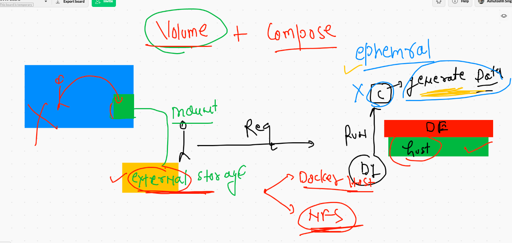

# Everything you need to know in COntainerization process

## things not to avoid 


## Use custom network 


# Docker  volume 



## volume options 


## creating and listing volumes 

```
❯ docker  volume   create  ashuvol1
ashuvol1
❯ docker  volume  ls
DRIVER    VOLUME NAME
local     anil-vol
local     ashuvol1
local     manuvol1
local     vishalvol1

```

### checking volume location on docker host 

```
❯ docker  volume  inspect  ashuvol1
[
    {
        "CreatedAt": "2021-03-24T04:16:53Z",
        "Driver": "local",
        "Labels": {},
        "Mountpoint": "/var/lib/docker/volumes/ashuvol1/_data",
        "Name": "ashuvol1",
        "Options": {},
        "Scope": "local"
    }
]


```
### creating container with volume attached 

```
❯ docker  run  -itd  --name ashuc1 -v  ashuvol1:/mnt/mydata:rw   alpine  sh
eb4b29b8bec83c547e8ace4c998f00bb8d1ec817ac8a2692630ba59c0363165d
❯ docker  ps
CONTAINER ID   IMAGE     COMMAND                  CREATED          STATUS                  PORTS     NAMES
f14a62be18bb   alpine    "sh"                     2 seconds ago    Up Less than a second             thejaswiC1
042095e32577   alpine    "sh"                     4 seconds ago    Up 2 seconds                      vijayc1
dabd9c476fa7   alpine    "sh"                     5 seconds ago    Up 3 seconds                      anilc1
19fb59c6f005   alpine    "sh"                     8 seconds ago    Up 6 seconds                      murali36c1
eb4b29b8bec8   alpine    "sh"                     8 seconds ago    Up 6 seconds                      ashuc1
88fed1441bc1   ubuntu    "/bin/bash -c 'apt-g…"   13 minutes ago   Up 13 minutes                     magical_cohen
❯ docker  exec  -it  ashuc1  sh
/ # cd  /mnt/
/mnt # ls
mydata
/mnt # cd  mydata/
/mnt/mydata # ls
/mnt/mydata # mkdir  hello cisco 
/mnt/mydata # ls
cisco  hello
/mnt/mydata # echo   hiii all  >hii.txt
/mnt/mydata # ls
cisco    hello    hii.txt


```

## mounting the same volume in another container with RO permission 

```
 docker  run  -itd  --name ashuc3 -v  ashuvol1:/mnt/ok:ro  busybox  sh 
```

## more volume demos

```
10316  docker  run -itd --name xashuc1  -v  /mydisk/hello1:/mnt/data   centos  bash 
10317  docker  exec -it  xashuc1  bash 
10318  docker  run -itd --name xashuc2  -v  /etc:/myhostetc:ro    centos  bash 
10319  docker  exec -it  xashuc2 bash 
10320  docker  volume  ls
❯  docker  run -it --rm   -v  /etc/group:/mygroup.txt:ro    centos  bash
[root@f2c6f871bef5 /]# cat  /mygroup.txt 
root:x:0:
bin:x:1:
daemon:x:2:
sys:x:3:
adm:x:4:ec2-user
tty:x:5:

```

## Docker client options 


## portainer as docker engine webui

```
docker  run -itd  --name webui --restart always -v  /var/run/docker.sock:/var/run/docker.sock -p 9000:9000 portainer/portainer
Unable to find image 'portainer/portainer:latest' locally
latest: Pulling from portainer/portainer
94cfa856b2b1: Pull complete 
49d59ee0881a: Pull complete 
a2300fd28637: Pull complete 

```

